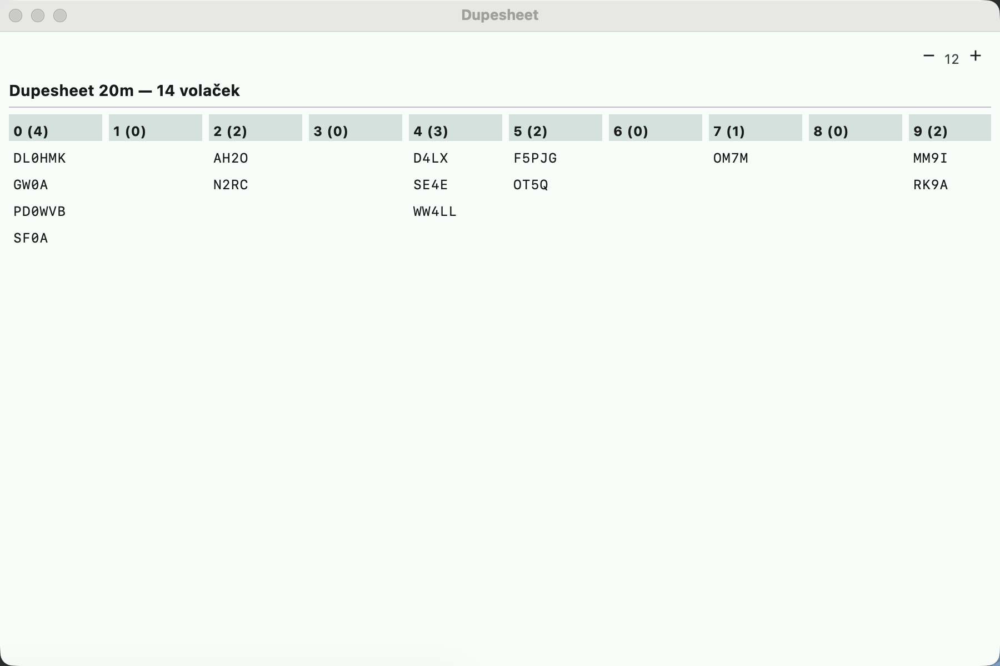

# Callsign check



Aids below the callsign field in the entry window.

## Worked before, by band

Equivalent of N1MM **Check** (band colors at the callsign) and DXLog **Check
callsign**. As soon as the callsign in the field has at least 3 characters and the
station is already in the log, a line appears:

```
Pracováno 3×, naposledy 1412Z:  160  80  [40 CW]  20 CW/SSB  15  10
```

(That is, "Worked 3×, most recently 1412Z".)

- The bands are the contest bands (outside a contest 160–10 m); a band not on the
  list on which a QSO exists (e.g. 6 m) is appended at the end.
- A **highlighted** band = the station is already there, with modes. **Red** = it
  is also on the current band (dupe by band; dupe by contest rules is shown by the
  DUPE chip).
- Dimmed bands = not worked yet — where to move the station.
- Deleted QSOs are not counted, X-QSOs are.

## Visible Dupesheet

Equivalent of N1MM **Visible Dupesheet**
([doc](https://n1mmwp.hamdocs.com/manual-windows/visible-dupesheet-window/)).
Open it with **"Okno → Dupesheet"** (Window → Dupesheet).

- Worked callsigns for the **current band** (from the rig, without CAT from the
  last QSO) — according to the contest's dupe rules also for the current mode
  (`PER_BAND_MODE`), mode only (`PER_MODE`) or the whole contest (`ONCE`). Outside
  a contest by band.
- Columns **0–9** by the digit of the area (OK1... → 1, `DL/OK1XOE` → 1),
  callsigns without a digit in the column **#**; counts in the header.
- Callsigns that contain the text typed in the callsign field (from 2 characters)
  are **highlighted** — a dupe is visible even before you finish typing.
- The dupesheet does not distinguish TOUR sessions (it shows the whole contest on
  the band).

## Downloading master.scp

Equivalent of N1MM **Tools → Download latest Check Partial file** and DXLog
**Update Super Check Partial database**. Menu **"Nastavení → Stáhnout master.scp"**
(Settings → Download master.scp):

- downloads the current `MASTER.SCP` from [supercheckpartial.com](https://www.supercheckpartial.com/),
- saves it to the file set in "Nastavení → Závod → Soubor master.scp" (Settings →
  Contest → master.scp file); when none is set, to the application data directory
  and sets the path right away,
- and loads it immediately — suggestions work with the new data without a restart.

It is downloaded to a temporary file and the original is overwritten only when the
content looks like master.scp (at least 1000 callsigns, not an HTML error page).
On an error the old file stays and the status line says why.

## Check partial: log, spots and master.scp

Equivalent of the N1MM **Check window** (including its [telnet
features](https://n1mmwp.hamdocs.com/manual-windows/check-window/#Special_Telnet_Features))
and DXLog **Check partials**. Suggestions below the callsign field (from 2
characters) come from three sources:

| Source | Appearance |
|---|---|
| **own log** | gray (already worked), red when it is a dupe on the band |
| **spots from the DX cluster** | underlined, in the highlight color — the station is on the band now |
| **master.scp** | normal |

Order: exact match → starts with the entered text → contains it; with an equal
match the log takes precedence, then spots, then master.scp. Thanks to the log and
spots, suggestions work even without a master.scp file and also find callsigns
that are not in it (new, special ones). Selection with the arrows / Enter / Alt+Y
as before.

## N+1

Equivalent of DXLog **Check N+1** and the N1MM **N+1** window. From 3 characters
of the callsign, a line `N+1:` appears below the suggestions with callsigns that
differ from the entered one by **exactly one character** — a substitution
(`OK1XOE` ↔ `OK1XDE`), an insertion (`OK1XOEE`) or an omission (`OK1XO`). It
catches reception errors that partial check does not find. Sources: log (gray),
spots and master.scp. A click takes the callsign into the field.
