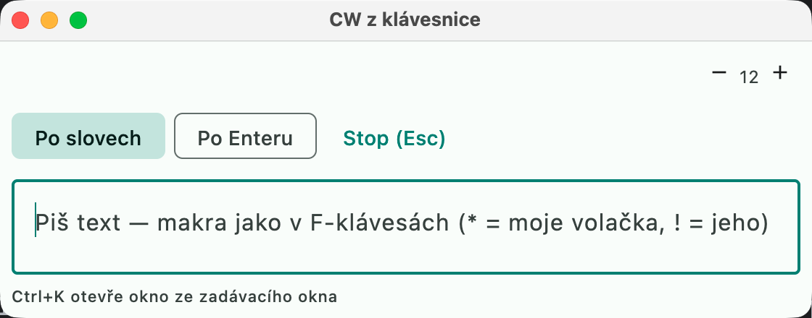
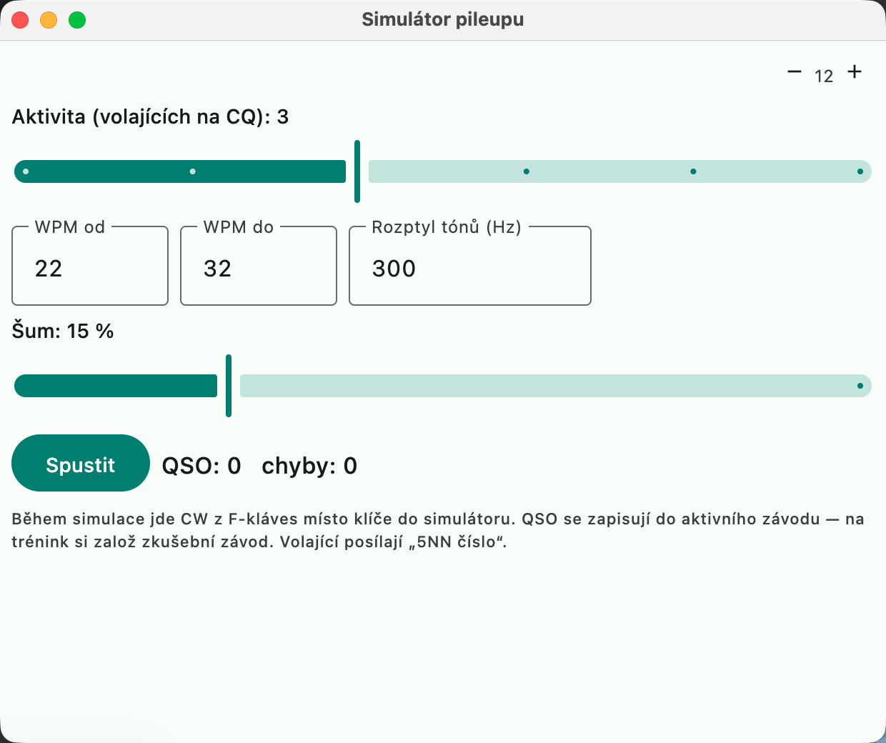

# CW keyer

In CW mode the function keys F1–F12 send CW messages. There are two ways to key,
just as in N1MM+
([Choosing Your CW Method](https://n1mmwp.hamdocs.com/setup/interfacing/#Choosing_Your_CW_Method))
and DXLog
([Winkey configuration](https://dxlog.net/docs/index.php?title=Menu_Options#Winkey_configuration)).

## "Nastavení → CW klíč" (Settings → CW keyer)

| Method | How it works | What it can do |
|---|---|---|
| **Rig keyer via CAT** (default) | text goes through rigctld to the keyer built into the rig (hamlib `send_morse`), e.g. Kenwood TS-590, Icom, Yaesu, Elecraft | plain text. Prosigns are sent as pairs of letters; speed changes `<` `>` inside a message are not supported by the rig |
| **K1EL Winkeyer** | serial port (USB), Winkeyer 2/3 protocol | everything: prosigns (AR, SK...), speed changes inside a message, precise interruption |
| **Off** | | |

For CAT the transceiver must be connected (icon in the info bar) and **the rig
must be in CW mode**. Otherwise hamlib refuses to transmit. The speed is set on
the rig automatically before the message.

**The rig must also have break-in switched on.** With CW via CAT the rig keys
itself when it receives the text, and most rigs only do that with break-in on;
with break-in off the message is accepted without an error (the CAT log shows
`RPRT 0`) but the rig only plays the sidetone, or nothing, and does not transmit.
On the Kenwood TS-590S/SG press **VOX** in CW mode ("BK-IN" lights up); semi or
full break-in and the delay are set in the rig's CW menu. If the F-keys "do
nothing" on the air, check break-in first.

Other options:
- **Speed (WPM):** default 28. In the entry window you change it with the
  **PgUp / PgDn** keys (±2 WPM) or with the spinner. It is saved when the program quits.
- **Cut numbers:** serial numbers with 0 → T and 9 → N (109 → 1TN).
- **Leading zeros:** serial numbers padded to three digits (007).

## "Nastavení → Function Keys → CW" (Settings → Function Keys → CW)

Messages F1–F12 separately for **Run** and **S&P**. The default set corresponds to
the N1MM "CW Default Messages.mc". The format is the same as in N1MM, so `.mc`
files can be carried over by hand.

| Macro | Meaning |
|---|---|
| `*` or `{MYCALL}` | my callsign |
| `!` or `{CALL}` | callsign from the callsign field; when the field is empty, the last logged one |
| `#` | serial number (according to the cut numbers / leading zeros options) |
| `{SENTRST}` | sent report from the Snt field |
| `{SENTRSTCUT}` | the same with cut digits (599 → 5NN) |
| `{EXCH}` | sent exchange from the contest setup without the report; the automatic serial number is substituted as `#` |
| `]` `[` `+` `=` | prosigns SK, AS, AR, BT |
| `<` `>` | speed +2 / −2 WPM from this point of the message (Winkeyer only) |
| `~` | half space (sent as a space) |
| `{LOG}` | logs the QSO |
| `{WIPE}` | clears the fields |
| `{RUN}` / `{S&P}` | switches the mode |

Other macros in `{}` are not sent yet, and the status line warns about them.

Example exchange for CQ WPX (serial number): `{SENTRSTCUT} #`, for CQ WW
(zone from the contest setup): `{SENTRSTCUT} {EXCH}`.

## Controls

| Key | Action |
|---|---|
| **F1–F12** or click on the button | sends the message. A running message is interrupted |
| **Esc** | stops transmission. Only the next Esc clears the fields |
| **PgUp / PgDn** | speed ±2 WPM |

The button of the message currently being sent is lit while it transmits. The
duration is calculated from real Morse code timing and the speed.

## Not available yet

- automatic CQ repeat,
- typing CW from the keyboard (N1MM Ctrl+K),
- keying via the DTR/RTS lines of a serial port,
- Winkeyer settings (paddle mode, sidetone, PTT lead/tail); the keyer's default
  values are used.

## More macros (N1MM)

| Macro | Content |
|---|---|
| `{LOGGEDCALL}` | the callsign logged most recently |
| `{NR}` | serial number (same as `#`) |
| `{MYNAME}`, `{MYGRID}` / `{MYLOC}`, `{MYCQZONE}` / `{MYZONE}`, `{MYITUZONE}`, `{MYSTATE}` | station data from "Nastavení → Stanice" (Settings → Station) |
| `{OPERATOR}` | operator at the keyer |
| `{TIME}` | UTC time `HHmm` |
| `{F1}`...`{F12}` | inserts the text of another F-key in the same set (chaining, at most 2 levels) |
| `{CLEARRIT}` / `{RITCLEAR}` | resets RIT |
| `{CQFREQ}` | jump to the CQ frequency (and clear the fields) |
| `{NOSPLIT}` | turns split off |

N1MM interface-control macros (`{CAT1ASC}`, `{TX}`/`{RX}`, `{KEYBOARD}`...) are not
sent and are reported in the status line as unknown.

## CW from the keyboard

Equivalent of the N1MM **CW keyboard** (Ctrl+K). **Ctrl+K** in the entry window
(or "Okno → CW z klávesnice", Window → CW from keyboard) opens a window where the
typed text is sent with the keyer:

- **By words** — each word is sent as soon as you type a space (default),
- **By Enter** — the whole line is sent with Enter,
- Enter sends the remainder, **Esc** stops transmission and clears the field,
- the F-key macros apply (`*` my callsign, `!` callsign from the field, `#` number...).

## CW Reader (CW decoding)

The window **"Okna → CW Reader"** (Windows → CW Reader) decodes CW from the
receiver audio (you set the input in "Nastavení → Audio → Příjem", Settings →
Audio → Receive, the same one used for the waterfall).

- The decoder listens at a tone pitch (default = the CW pitch from the settings,
  changeable in the window).
- The speed is estimated continuously from the length of the dots and shown as "~N WPM".
- The threshold adapts to signal strength and noise; a weak signal below the noise is not decoded.
- Callsigns found in the text (newest first, excluding your own) are shown above
  the text as buttons — a click puts the callsign into the callsign field.

The decoder is simple (a Goertzel filter plus timing measurement). It works well
on a clean single-tone signal; in a pileup with several stations on the same tone
it gets confused, like any such decoder.

## Pileup simulator (similar to Morse Runner)

**"Okna → Simulátor pileupu"** (Windows → Pileup simulator) starts practice
without a rig: CW from the F-keys (also from ESM and the CW keyboard window) goes
to the simulator instead of the keyer, and both your own CW and the calling
stations play from the speaker (tone = CW pitch, callers spread around it).

- On **CQ / TU / QRZ** callers answer (the number depends on "Aktivita", Activity);
  impatient ones leave after a few CQs.
- If you send a caller's **callsign**, they reply "5NN number"; on
  **? / AGN / NR?** they repeat the exchange.
- On a **partial callsign with a question mark** ("OK1?") the matching stations
  answer; on a callsign **with one error** the station corrects it ("DE OK1ABC OK1ABC").
- After logging, the QSO is compared with what the station sent: the window shows
  the number of QSOs, errors, and for each QSO what was correct.
- Callsigns are taken from master.scp (Database); without it they are made up.

QSOs are written to the **active contest**, so create a practice contest for
training. The simulation is simpler than Morse Runner: no QSB, QRM or flutter, and
the exchange is always RST + serial number.
