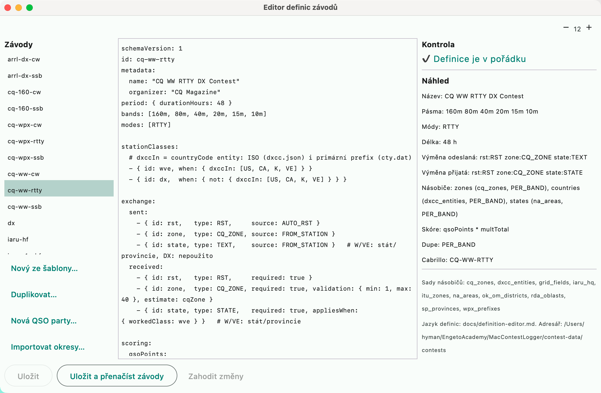

# Contest definition editor



Equivalent of the N1MM+ **UDC Editor**
([The UDC Editor](https://n1mmwp.hamdocs.com/appendices/udc-editor/#The_UDC_Editor)).
Contests are declarative YAML in the contest data directory ("Nastavení → Závod →
Nastavení dat závodů…", Settings → Contest → Contest data settings...); the editor
edits them directly in the application.

To open it: **"Závod → Editor definic…"** (Contest → Definition editor...)

## The window

| Part | What it does |
|---|---|
| **Contests** (left) | definitions from `<data>/contests/*.yaml`; a click opens the file |
| **"Nový ze šablony…"** (New from template...) | asks for an id (= file name, lowercase letters, digits, `-`, `_`) and inserts a valid template: RST + serial number, 1 point per QSO, DXCC multipliers per band |
| **"Duplikovat…"** (Duplicate...) | a copy of the open definition under a new id — the quickest way to a variant of an existing contest |
| **text** (middle) | the YAML definition, monospaced font |
| **Check** (right) | live while typing: YAML syntax (with line and column), unknown keys, the definition validator, **references to nonexistent multiplier sets**, mismatch of `id` with the file name. ✖ error, ⚠ warning |
| **Preview** | name, bands, modes, duration, exchange fields, multipliers, score formula, dupe, Cabrillo name |
| **"Uložit"** (Save) | writes the file atomically (first to a temporary one, then a move) |
| **"Uložit a přenačíst závody"** (Save and reload contests) | additionally reloads the definitions so the contest can be selected right away in New contest |
| **"Zahodit změny"** (Discard changes) | returns the text to the saved state |

A definition with errors can be saved (work in progress), but the application
skips it when loading — it does not appear in the contest list until you fix the
errors. You can switch to another file only without unsaved changes.

## The definition language in brief

```yaml
schemaVersion: 1
id: my-contest                 # = název souboru
metadata: { name: "Můj závod", organizer: "", officialUrl: "" }
period: { durationHours: 24 }  # bez period = bez konce; sezení: sessions: { start: "1200", minutes: 30 }
bands: [80m, 40m, 20m]
modes: [CW, SSB]
exchange:
  sent:     [ { id: rst, type: RST, source: AUTO_RST }, { id: nr, type: SERIAL, source: AUTO_SERIAL } ]
  received: [ { id: rst, type: RST, required: true },   { id: nr, type: SERIAL, required: true } ]
scoring:
  qsoPoints: { mode: FIRST_MATCH, default: 1 }   # pravidla `rules:` s podmínkami when
  total: "qsoPoints * multTotal"
multipliers:
  - { id: countries, set: dxcc_entities, from: callsign, scope: PER_BAND }
dupe: { scope: PER_BAND_MODE, dupeWorthZero: true }
cabrillo: { contestName: MY-CONTEST, sentOrder: [rst, nr], receivedOrder: [rst, nr] }
ui: { entryOrder: [call, rst, nr], logColumns: [time, call, band, mode, rst, nr] }
```

- field **type**: `RST RS SERIAL INTEGER TEXT LOCATOR CQ_ZONE ITU_ZONE DXCC PREFIX HQ
  NATIONAL STATE PROVINCE DISTRICT IOTA QTC`.
- **source** of a sent field: `MANUAL AUTO_RST AUTO_SERIAL FROM_STATION DERIVED ROVER_QTH`.
- **scope** of multipliers and dupe: `PER_BAND PER_BAND_MODE PER_MODE ONCE`.
- the multiplier **set** = the id of a set in `<data>/multipliers/` (the list is
  at the bottom of the right panel).

Full examples are in the built-in definitions (`contest-data/contests/` — CQ WW,
WPX, IARU, OK-OM DX...); it is best to **duplicate** one and edit it. Converters
for foreign N1MM (UDC) and DXLog definitions exist only in the earlier Java
version 1.1.1, not in this application.

## Updating definitions from the internet

Equivalent of N1MM **Check for updated contest definitions**. Menu **"Závod →
Aktualizovat definice z internetu"** (Contest → Update definitions from the
internet):

- downloads `index.txt` and the files listed in it from the published
  [`contest-data`](https://github.com/ok1xoe/MacContestLogger/tree/main/contest-data)
  directory (contest definitions, multiplier sets, band plan, digital
  frequencies) into the contest data directory from Settings,
- adds new files and updates changed ones — it **does not overwrite locally
  modified files** (it recognizes them by the hash from the last download in
  `.update-manifest.properties`),
- it does not write a definition that fails the editor's check,
- after downloading it reloads the definitions; the status line shows a summary,
  the messages window the details.

To return a modified file to the published version, simply delete it and run the
update again.
