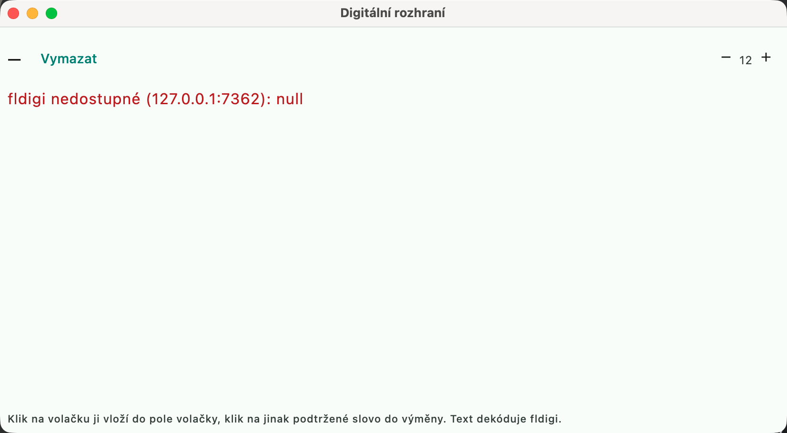

# Digital modes

## fldigi as a modem (RTTY, PSK...)

MCL has no built-in audio modem for transmitting — like N1MM with fldigi, it
leaves modulation/demodulation to **fldigi** and controls it through its XML-RPC
interface.

1. Start fldigi (XML-RPC is enabled by default on port **7362**).
2. In MCL: **"Nastavení → Digitální módy → Modem pro RTTY / PSK → fldigi"**
   (Settings → Digital modes → Modem for RTTY / PSK → fldigi), enter the address
   and port and click **"Vyzkoušet"** (Test; it shows the fldigi version and the
   current modem).
3. The F1–F12 messages for digital modes are in **"Nastavení → Function Keys →
   Digi"** (Settings → Function Keys → Digi), separately for Run and S&P (macros
   as for CW: `*`/`{MYCALL}`, `!`, `#`, `{SENTRST}`, `{EXCH}`, `{LOG}`,
   `{WIPE}`...; numbers are not shortened).

In RTTY/PSK/... mode the F-keys then transmit through fldigi (text into the TX
buffer, TX on, and after sending fldigi switches to receive by itself). ESM and CQ
repeat work; **Esc** interrupts transmission (`main.abort`).

## The Digital interface window

**"Okna → Digitální rozhraní"** (Windows → Digital interface) — the equivalent of
N1MM *Digital Interface*. MCL pulls the decoded text from fldigi and draws it
**in its own window**, so you can work with it directly:



- **A click on a callsign puts it into the callsign field** (your own callsign is
  not underlined). You do not click in fldigi — XML-RPC has no "user clicked on a
  word" feature, so there is no path back from there. That is why the text must
  be in the logger's window, as in N1MM.
- **A click on an otherwise underlined word puts it into the exchange.** Where it
  belongs is decided by the contest definition: first the `validation` from the
  YAML (range, length, regex), then the shape according to the field type. In CQ
  WW RTTY, `599` goes into the report and `15` into the zone — it cannot land in
  the report because RST has three digits. Of several matching fields, **the first
  empty one** wins, so a partly filled exchange is not overwritten by a click as
  long as there is somewhere else to write. A word that fits nowhere is not underlined.
- **A double exchange is recognized as a whole.** Fields are assigned by the
  callsign **on the same line**, not by the one being typed — the exchange belongs
  to the station that sent it. In CQ WW RTTY, for `W3LPL 599 05 NY` both the zone
  **and** the state are highlighted, whereas for `DL1ABC 599 14` only the zone is,
  because only W/VE stations send a state. You click into both fields separately.
- Above the text is a **callsign list** in the order in which the callsigns
  appeared. The order is never rearranged — otherwise it would change under the
  cursor in a pileup and a click would hit the wrong callsign.
- The top bar shows the **modem and the TX/RX state** and a **"Vymazat"** (Clear)
  button (it clears only the window; the RX buffer in fldigi stays, so the text
  does not start being read again).
- **F1–F12, Enter and Esc work here too.** After clicking a callsign the keyboard
  stays in this window, so otherwise you could not fire F4 (callsign) or F2
  (exchange) right away. The keys are sent to the entry window, where all the
  logic lives: **Shift+F** takes the message from the opposite set (Run ↔ S&P),
  **Enter** performs an ESM step or logs the QSO, and **Esc** stops transmission.
  Focus stays in the window, so from one place you can pick a callsign, send the
  exchange and log the QSO.

Reading is **incremental**: MCL asks for the length of the RX buffer
(`text.get_rx_length`) and fetches only what it does not have yet (`text.get_rx`).
If you clear the buffer in fldigi, this is detected by the shortening and reading
starts from the beginning, but the history in the window stays. The polling
interval is 300 ms — compared with MMTTY embedded directly in N1MM, the text lags
by that fraction of a second.

Who decodes does not change: the modem is still fldigi. MCL has its own RTTY
decoder only in the separate proof of concept `digimode-poc`.

## Sharing CAT with fldigi

When MCL controls the rig, its `rigctld` holds the serial port and fldigi **will
not open it**. In fldigi, therefore, set **Configure → Rig Control → Hamlib**, rig
**Hamlib NET rigctl** and device `localhost:4532` — both programs then talk to one
daemon. Leave PTT on "PTT via Hamlib command"; RTS/DTR cannot be used on that
port, and for rigs with hardware handshake (e.g. TS-590SG over USB) hamlib rejects
them.

In the **"Spustit rigctld"** (Start rigctld) mode, however, the daemon is a
subprocess of MCL, so when the application quits it ends too and fldigi loses the
connection (only "Initialize" in its rig control settings helps). Anyone who runs
digital modes regularly should **start the daemon themselves** and choose
**"Připojit k běžícímu"** (Connect to running) in **"Nastavení → Hardware →
Připojení"** (Settings → Hardware → Connection):

```bash
rigctld -m <model> -r <zařízení> -s <rychlost> -t 4532
```

Restarting MCL then does not upset fldigi. On macOS this can be hung on a launchd
agent (`~/Library/LaunchAgents`) so that the daemon starts by itself after login.
