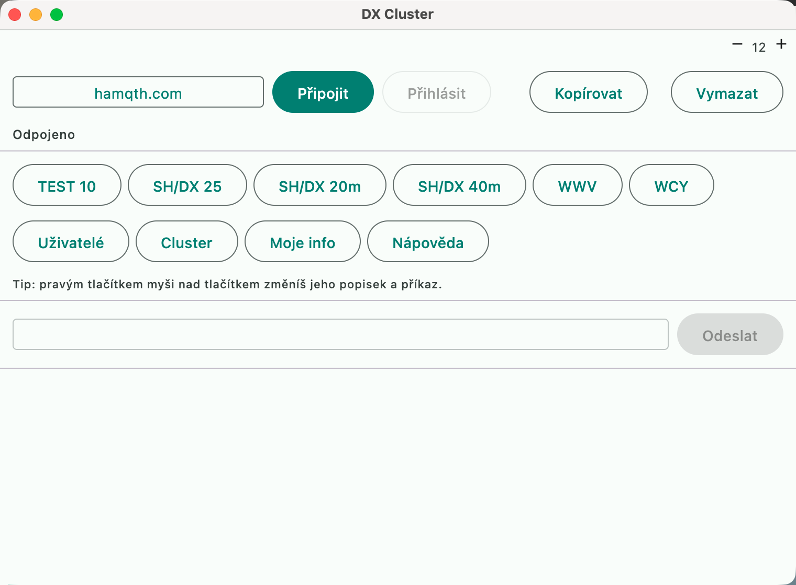
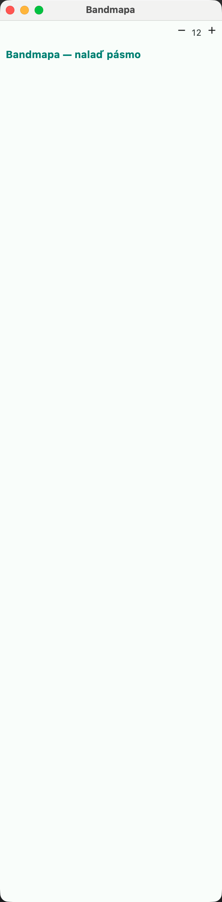

# DX cluster

## Several simultaneous connections (nodes + skimmers)

Equivalent of DXLog.net **DXC** (several nodes and skimmers at once). Besides the
main connection from the **DX Cluster** window, others can run:

1. **"Nastavení → DX Cluster"** (Settings → DX Cluster): for a favorite, tick
   **"Souběžně"** (Simultaneously) (e.g. RBN `telnet.reversebeacon.net:7000`, a
   local CW Skimmer Server, a second node).
2. After OK (and at every start) the simultaneous favorites connect by themselves
   and **log in** with the saved name (callsign).
3. Spots from all connections go into **one bandmap** and one buffer (same
   filters, blacklist, multiplier colors). The listing in the DX Cluster window
   shows lines from the simultaneous connections with the prefix `[name]`.
4. Below the status of the main connection is a line `Souběžně: RBN ✓ · Skimmer ...`
   ("Simultaneously: ...") (✓ logged in, ... connected, ✗ disconnected). A dropped
   connection is reopened after the next save of the settings.

A favorite to which the main window is currently connected is not duplicated as a
simultaneous one. Unticking **"Souběžně"** closes the connection. Commands from
the DX Cluster window go only to the main connection.

## CW Skimmer / RBN

Equivalent of N1MM **CW Skimmer and the Reverse Beacon Network**
([doc](https://n1mmwp.hamdocs.com/manual-windows/telnet-window/#CW_Skimmer_and_the_Reverse_Beacon_Network_RBN_))
and DXLog **DX cluster own station spots**.

- **Connection**: RBN (`telnet.reversebeacon.net`, port 7000 CW / 7001 digital) or
  a local CW Skimmer Server as a favorite — ideally **simultaneously** with a
  regular node.
- **Recognition**: a skimmer spot = the spotter ends with `-#`, or the comment has
  the form `19 dB 28 WPM CQ`.
- **Skimmer count**: the same station reported by several skimmers (within 1 kHz)
  is counted as one spot with a confirmation count; the bandmap shows `OK1XOE ×3`.
- **Filter** (Settings → DX Cluster → "Skimmer spoty: min. skimmerů", Skimmer
  spots: min. skimmers): `0` hides skimmer spots, `1` shows all, `2` and more
  shows only stations confirmed by at least that many skimmers — it filters out
  "busted" spots with a wrongly decoded callsign. Spots from humans are always shown.
- **Own spots**: when RBN / a skimmer hears me, a message arrives in the Info
  window messages, "RBN: ... hears you on 14025.0 kHz, 19 dB, 28 WPM".

## Sharing telnet over the network

Equivalent of N1MM **Multi-User telnet** and DXLog.net **DXC** on a network. In a
network log (cluster sync over MQTT) it is enough for **one** station to have the
DX cluster connected:

- each spot that a station receives from its cluster (main and simultaneous) is
  sent through the broker to the topic `spot/new` (QoS 0, no retain),
- other stations insert it into their bandmap — same colors, filters, blacklist;
  it is not forwarded further and a station does not get its own spots back,
- it is turned on in **"Nastavení → Cluster → Sdílet spoty z DX clusteru"**
  (Settings → Cluster → Share spots from the DX cluster) (on by default; it is
  enough on the stations that should send / receive spots).

The broker must allow the stations `spot/#` — see `docs/cluster-aclfile`
(`pattern readwrite spot/#`). The authority (a separate Java application,
`cluster-app`, Java 21, which is not part of this repository) does not process spots.

## Automatic split from the spot comment

Equivalent of N1MM **Split Mode and Frequencies Set Automatically from Cluster Spots**
([doc](https://n1mmwp.hamdocs.com/manual-operating/single-operator-contesting/#Split_Mode_and_Frequencies_Set_Automatically_from_Cluster_Spots))
and DXLog **DX cluster → auto split**. After a click on a spot (bandmap, cluster
window, Ctrl+↑/↓) the transmit frequency is read from the spot comment and split
is turned on (transmitting on VFO B):

| Comment | I transmit on (spot 14023.0) |
|---|---|
| `UP 5`, `up5`, `UP 2-4` | +5 / +5 / +2 kHz → 14028 / 14028 / 14025 |
| `UP 1.5` | 14024.5 |
| `UP` | default shift: +1 kHz (CW), +5 kHz (phone according to the comment) |
| `DOWN 3`, `DN 3` | 14020 |
| `QSX 14025.5` | 14025.5 |
| `QSX 025`, `QSX25` | completed from the spot frequency → 14025 |

- A split farther than 100 kHz from the spot is ignored (typo, another band).
- A spot without split turns off a split that the previous spot turned on; a
  manually turned-on split (Ctrl+S, Alt+F7) is left alone.
- It can be turned off in **"Nastavení → DX Cluster → Automatický split z komentáře
  spotu"** (Settings → DX Cluster → Automatic split from the spot comment).

## Band plan in the bandmap

Equivalent of N1MM **Display of Band Plans in Background of Bandmap Frequency Scale**
([doc](https://n1mmwp.hamdocs.com/manual-windows/bandmap-window/#Display_and_Adjustment_of_Band_Plans_in_Background_of_Bandmap_Frequency_Scale))
and the DXLog band plan in the Radio window. The bandmap shades segments of
operation with a strip right of the frequency axis, with a vertical label inside:

| Segment | Color | Label |
|---|---|---|
| CW | indigo | `CW` |
| Digital | amber | `DIGI` |
| Phone | turquoise | `FONE` |

- The IARU region that applies to **my** station is drawn (according to the
  continent of my own callsign) — it is a guide for my transmitting, not for the
  DX station.
- Segments are taken from `contest-data/bandplan.yaml`, that is, from the same
  source used to estimate the spot mode and Mode Control "according to band plan".
  It is edited in **"Nastavení → Bandplán"** (Settings → Band plan); a change takes
  effect immediately.
- With zoom, segments are clipped to the visible window. A label is drawn only
  when it fits into the height of the segment — in a zoomed-out view a narrow
  digital band therefore stays colored but without text.
- An overlap of two segments (the file allows it; e.g. R2 has digital inside CW on
  80 m) is drawn the same way the mode estimate evaluates it: the earlier segment
  wins, the later one is shortened by the overlap. The bandmap thus never shows a
  different category than the program would use on that frequency.
- It can be turned on/off in two ways: **right click in the bandmap → "Skrýt /
  Zobrazit bandplán"** (Hide / Show band plan), or **"Nastavení → Bandplán →
  Podbarvit úseky v bandmapě"** (Settings → Band plan → Shade segments in the
  bandmap). The choice is saved in the configuration.
