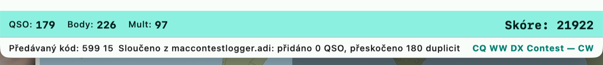

# Import and export

## ADIF

**"Soubor → Export → Export ADIF…"** (File → Export → Export ADIF...) (or the command
`EXPORT`) writes ADIF 3.1.4 with the QSOs of the active contest — or, in free
logging, the QSOs logged without a contest:

| Field | Content |
|---|---|
| `QSO_DATE`, `TIME_ON`, `CALL`, `BAND`, `FREQ`, `MODE` | QSO basics |
| `RST_SENT`, `RST_RCVD`, `STX`, `SRX` | reports and serial numbers |
| `STX_STRING`, `SRX_STRING` | the whole sent / received exchange (zone, county, locator...) |
| `CONTEST_ID` | Cabrillo name of the active contest (`CQ-WW-CW`) |
| `DXCC`, `COUNTRY`, `CONT` | country and continent |
| `APP_N1MM_RUNNING` | Run (`Y`) / S&P (`N`), N1MM extension |
| `OPERATOR`, `COMMENT` | operator, note |

Import (`IMPORT`) reads `SRX_STRING` / `STX_STRING` back into the exchange (the
report at the start is not tripled), so export → import preserves the exchange
also for score recalculation.

## EDI (REG1TEST, VHF)

**"Soubor → Export → Export EDI (VKV)…"** (File → Export → Export EDI (VHF)...) writes, for
each band of the log, a file `<CALLSIGN>_<band>.edi` in the **REG1TEST** format
(IARU Region 1, VHF contests):

- header: contest name, dates, callsign, locator (must be 6 characters in
  "Nastavení → Stanice", Settings → Station), section (SINGLE / MULTI from the
  contest category), band (`144 MHz`), address, power and antenna from the station,
  operators,
- summaries: number of QSOs, points (km), number of large squares (`CWWLs`) and
  countries (`CDXCs`), total score and **ODX** (the most distant contact),
- QSO lines: date, time, callsign, mode code (1 SSB, 2 CW, 6 FM...), reports and
  numbers, locator, points (km), `N` for a new square and country, `D` for a dupe
  (0 points).

The other station's locator is taken from the `LOCATOR` field of the exchange (VHF
contests in the data — IARU R1 VHF/UHF, Marconi Memorial — have it).

## CSV, text and summary

**"Soubor → Export → Export CSV, text a souhrn…"** (File → Export → Export CSV, text and
summary...) writes into the chosen directory:

| File | Content |
|---|---|
| `<CALLSIGN>.csv` | CSV (comma, quoting per RFC 4180) — time, callsign, band, kHz, mode, reports, numbers, exchanges, country, continent, Run/S&P, operator, X-QSO, note |
| `<CALLSIGN>.txt` | a text listing with fixed columns — for printing or as an attachment |
| `<CALLSIGN>-summary.txt` | summary: contest, station, period, QSOs / points / multipliers / score (recalculated), band × mode table |

## Merging logs

Equivalent of N1MM **Merge logs** and DXLog **Merge**. **"Soubor → Import →
Sloučit deník…"** (File → Import → Merge log...) adds QSOs from another log to the current one:

- a MacContestLogger database (`.sqlite`, e.g. the log of a second station without
  network) — the QSOs of the same contest are taken if the source has them,
  otherwise all,
- an ADIF or Cabrillo file (the exchange is converted as in import).

Only QSOs that are not yet in the log are added: the same callsign, band and mode
and a time within **±2 minutes** (different station clocks), or the same `uuid`.
Duplicates inside the merged log are skipped too. After merging, the score is
recalculated and the status line shows how many QSOs were added and how many were
skipped.

## Copying a contest to another database

Equivalent of N1MM **Copy This Contest to Another Database** and **Copy All Contests to Another Database**.
**"Soubor → Zkopírovat závod do jiné databáze…"** (File → Copy contest to another database...) opens a window:

- **Závod** (Contest): the active contest (the default), any other contest of the open database, or **Všechny
  závody** (All contests; the QSOs logged without a contest go along),
- **Cílová databáze** (Target database): another existing database, or **Nebo nová databáze (název)** (a new one
  by name; a typed name wins over the chosen one). The open database cannot be the target.

What is copied: the contest row (definition snapshot, setup, station), its QSOs and its QTC records (WAE).

- The **open database is only read**, never changed.
- **Identity is kept**: the contest id and every QSO's `uuid`, version and station are copied as they are. So
  copying again adds only the QSOs that are new in the source (matched by `uuid`, then by call, band, mode and time
  within 2 minutes as in merging), and a database that is later synchronised sees the same QSOs, not new ones.
  The same QSO then exists in two database files, but only one database is open at a time.
- A contest the target already has keeps its stored row; only the QSOs it lacks are added.
- Deleted QSOs (tombstones) are not copied.
- The copy into the target is one transaction: if it fails, the target stays as it was.

The status line reports the target, the number of contests and QSOs copied and how many QSOs were already there.

## Printing the log

**"Soubor → Tisk deníku…"** (File → Print log...) opens the system print
dialog (printer, PDF) and prints a text listing of the log — a monospaced font,
column headings on every page, and in the footer the contest name, callsign and
page number.

## Recalculating DXCC in the log

**"Nástroje → Přepočítat DXCC v deníku…"** (Tools → Recalculate DXCC in the
log...) goes through all contacts and derives the country (DXCC number, name,
continent) again from the callsign according to today's country file. Unlike
filling in at logging time, which touches only empty fields, this action
**overwrites even what is already stored** — including data from an imported log
that may have been determined more precisely than a guess from the prefix. That
is why it asks for confirmation.

It is useful when the stored numbers are demonstrably wrong (logs written before
the derivation of the DXCC number from `cty.dat` was fixed). Contacts whose
callsign the country file does not know stay unchanged — it should not guess.
When finished, the status line shows how many QSOs were affected.

## Automatic backup

**"Nastavení → Závod → Automatická záloha deníku"** (Settings → Contest →
Automatic log backup):

- **interval** (default 15 min, 0 = off) — a backup only when the log has changed
  since the last backup, and always when the application quits,
- **number of backups** (default 10) — older automatic backups are deleted,
- **directory** (default `.../MacContestLogger/backups`).

Backups `<log>-auto-<UTC time>.sqlite` are consistent copies of the database
(SQLite `VACUUM INTO`) and can be opened as a log. A manual backup next to the
log: the command `COPYLOG` (that one is not deleted).
