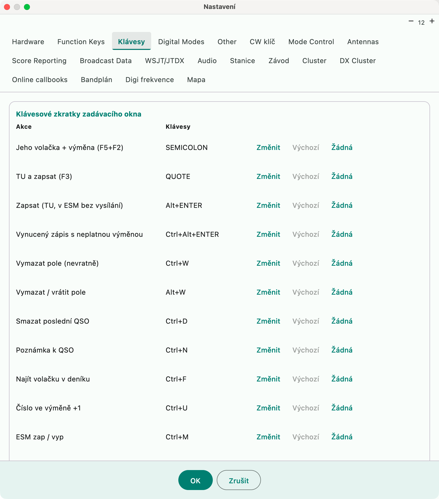

# Entry window keyboard shortcuts

The shortcuts follow N1MM+
([Keyboard Shortcuts](https://n1mmwp.hamdocs.com/setup/keyboard-shortcuts/#Key_Assignments_Short_List)).
On a Mac, **Alt** is the **Option (⌥)** key. Below are the **default** keys — most of
them can be remapped (see [Remapping keys](#remapping-keys)).

## Why Ctrl and not Cmd

On a Mac you would expect **⌘**, but the default here is **Ctrl** and **Alt** — and
that is deliberate. A contester usually knows N1MM, operates on other people's
machines and has `Ctrl+W`, `Alt+Q`, `Ctrl+D` in their head. If it were translated to
⌘, N1MM help from others would no longer apply and switching to another computer
would be confusing. In a contest, muscle memory beats platform habit.

In practice this is not a problem: **macOS system shortcuts use ⌘**, so
`Ctrl+letter` is free. The application also takes them before they reach the field.
The exception is **Ctrl+arrows**, which Mission Control takes — which is why
jumping between spots defaults to **Cmd+↓/↑** instead (see below).

**Cmd is a fully valid choice.** In **Nastavení → Klávesy** (Settings → Keys) every
action can be remapped and `Cmd+…` is a valid combination (stored as `"Cmd+DOWN"`).
Anyone who wants a mac-native logger can remap all of it; nobody else is affected.

## Moving between fields

| Key | Action |
|---|---|
| **space bar** | next field, **skipping the reports** (599/59 are pre-filled). From the callsign it goes to the exchange, from the last field back to the callsign |
| **Tab** / **Shift+Tab** | next / previous field including the reports |
| **Enter** | logs the QSO (with ESM see [esm.md](esm.md)); runs a command in the callsign field ([text-commands.md](text-commands.md)) |
| **Esc** | stops transmitting, tuning and CQ repeat; when nothing is running, clears the fields |

## Logging

| Key | Action |
|---|---|
| **Alt+Enter** | sends TU (F3) and logs. With ESM it only logs, transmits nothing |
| **Ctrl+Alt+Enter** | logs even with an **invalid exchange**; asks for a note (empty = "Forced QSO") |
| **;** | sends his callsign + exchange (F5 + F2), like N1MM Insert |
| **'** (apostrophe) | sends TU (F3) and logs |
| **Ctrl+W** | clears the fields (irreversibly) |
| **Alt+W** | clears the fields; another Alt+W with empty fields **restores** them |
| **Ctrl+D** | deletes the last QSO (with confirmation) |
| **Ctrl+N** | note: with a callsign filled in, for the QSO in progress, otherwise for the last logged one |
| **Ctrl+F** | finds the callsign from the field in the log (opens the QSO overview with the search `call:`) |
| **Ctrl+U** | serial number in the exchange +1 |
| **Alt+Y** | first Super Check Partial suggestion into the callsign field |
| **↑ / ↓** | with SCP suggestions, moves within the suggestions, otherwise tunes the rig |
| **Ctrl+O** | operator login |

## Messages and keying

| Key | Action |
|---|---|
| **F1–F12** | message (phone voice keyer, CW keyer) — [voice-keyer.md](voice-keyer.md), [cw-keyer.md](cw-keyer.md) |
| **Shift+F1…F12** | message from the opposite set (Run ↔ S&P); holding Shift shows the labels |
| **Ctrl+Shift+F1…F12** | records a message (phone) |
| **=** | in ESM repeats the last message |
| **PgUp / PgDn** | CW speed ±2 WPM |
| **Ctrl+G** | cut numbers on / off |
| **Ctrl+M** | ESM on / off |
| **Alt+R** / **Ctrl+R** | CQ repeat on / off; pause between CQs |
| **Ctrl+T** | **tune**: continuous carrier (Winkeyer key-down, via CAT PTT in CW). Ctrl+T or Esc ends it, **30 s safety cutoff** |
| **Alt+K** | Settings → Function Keys |
| **Ctrl+K** | **keyboard CW** window — typed text is sent word by word or on Enter, Esc stops |
| **Ctrl+Alt+P** | **pass** — hands the callsign from the field to another station of the network log (directly to the only online station, otherwise a choice in the Network status window) |
| **Ctrl+Alt+K** | next callsign from the **partner's stack** into the callsign field (call stacking) |

## Rig

| Key | Action |
|---|---|
| **↑ / ↓** (without SCP suggestions) | tune by a step: **↑ down, ↓ up**; 20 Hz in CW and digital, 100 Hz in phone |
| **mouse wheel** over the entry window | tune by a step; **Alt** to the next whole 1 kHz, **Ctrl** 10 kHz, **Ctrl+Alt** 100 kHz |
| **Ctrl+PgUp / PgDn** | one band up / down. Returns to the last frequency on the band, otherwise to the start of the mode segment. In a contest only its bands, WARC is skipped |
| **Alt+F8** | back to the previous frequency (after a jump to a spot, Alt+Q...) |
| **Alt+U / Alt+Q / Alt+F11** | Run/S&P, back to the CQ frequency, Run/S&P automation — [run-sp.md](run-sp.md) |
| **Ctrl+S** | turns on split (transmit on VFO B) |
| **Ctrl+Alt+S** | toggles split on / off |
| **Alt+F7** | split to the entered frequency or offset (`+2`); empty = turn split off |
| **Ctrl+Enter** | frequency in the callsign field = transmit (split) frequency |
| **Alt+F10** | swaps VFO A ↔ B |
| **Alt+F12** | VFO A frequency to VFO B |

## Bandmap and spots

| Key | Action |
|---|---|
| **Cmd+↓ / Cmd+↑** | next spot **higher / lower** on the band (dupes are skipped) |
| **Ctrl+Alt+↓ / ↑** | next spot that is a **new multiplier** |
| **Shift+Alt+↓ / ↑** | next **own** spot (Store / self-spot) |
| **Alt+D** | removes the spot of the callsign in the field (or the spot on the frequency); in the Bandmap window the spot under the mouse |
| **Alt+Shift+D** | the same and puts the callsign on the **blacklist** (also in the Bandmap window) |
| **Alt+P** / **Spot It** button | spot to the DX cluster |
| **Ctrl+P** | spot with a comment |
| **Alt+O** / **Store** button | stores the callsign from the field in the bandmap at the current frequency |
| **Alt+M** / **Mark** button | marks the frequency in the bandmap as occupied (also while the Bandmap window has the focus) |
| **Ctrl+Tab** | show / hide the DX cluster window |

Alt+M, Alt+D and Alt+Shift+D also work while the Bandmap window is the active window, with your own key assignments. In the Bandmap window Alt+D removes the spot under the mouse pointer; with the pointer elsewhere it acts as in the entry window.

## Rotator and antennas

| Key | Action |
|---|---|
| **Alt+J** | rotator to the callsign in the field (otherwise the last QSO), short path |
| **Ctrl+Alt+J** | the same via the long path |
| **Alt+L** | stop the rotator |
| **Ctrl+Alt+A** | next antenna for the band |

## Other

| Key | Action |
|---|---|
| **Alt+H** | help (project documentation) |

## Remapping keys

An equivalent of the N1MM **Key Mapper**: **Nastavení → Klávesy** (Settings → Keys)
lists all entry window actions with their keys.

- **Změnit** (Change) — press the new combination (Esc cancels). The combination must include Ctrl, Alt
  or Cmd; without a modifier only F-keys, **;** and **'** are allowed (otherwise the shortcut
  would override typing in the fields).
- **Výchozí** (Default) restores the N1MM key, **Žádná** (None) removes the key from the action,
  **Vše na výchozí (N1MM)** (All to default (N1MM)) cancels all remapping.
- Remapped keys are in **bold**, a collision of two actions in **red**. In a collision the
  remapped action wins.
- Saved to `config.json` (`keyBindings`: action id → e.g. `"Cmd+DOWN"`) and effective immediately after OK.

The basics of entry cannot be remapped: F1–F12 (messages and their Shift/Ctrl+Shift variants),
Enter, Esc, Tab, space bar, arrows (tuning / SCP suggestions), PgUp/PgDn (CW speed) and "=".

Typical use on a Mac: **Ctrl+↓/↑** (the N1MM key for jumping between spots) is taken by
Mission Control, so the jumps default to **Cmd+↓/↑** and you do not have to change system
shortcuts. An existing remapping you saved keeps working; remap to **Ctrl+↓/↑** if you
turned the Mission Control shortcuts off.

## macOS: conflicts with the system

- **Ctrl+↑/↓/←/→** are used by macOS by default for Mission Control and Spaces, which is why
  the jumps between spots are on **Cmd+↓/↑** here. To use the N1MM keys **Ctrl+↓/↑** instead,
  turn the system shortcuts off in System Settings → Keyboard → Keyboard Shortcuts →
  Mission Control and remap the action in Settings → Keys.
- **F-keys:** when they change brightness or volume, hold **fn**, or turn on "Use
  F1, F2, etc. keys as standard function keys".
- **Option+F11** may be captured by the system. Run/S&P automation can also be toggled with the command
  `AUTORSP` / `NOAUTRSP`.
- The **;** and **'** keys are taken by physical position on a US keyboard
  (next to L). On a Czech keyboard these are the **ů** and **§** keys.

## Unsupported N1MM shortcuts

SO2R/SO2V (**\\**, Pause, Ctrl+←/→, Alt+F5/F6, Ctrl+Alt+D), quick edit
**Ctrl+Q/A** and **Ctrl+Y**, filters **Alt+'**, callsign stack
**Alt+G / Ctrl+Alt+G**, multi-op **Ctrl+Alt+M / Alt+Z**, autosend **Ctrl+Shift+M**.

## RIT

| Key / command | Action |
|---|---|
| **Ctrl+Alt+→ / ←** | RIT one step up / down (20 Hz CW and digital, 100 Hz phone) |
| **Ctrl+Alt+R** | RIT off |
| `RIT 120`, `RIT -50` | RIT to the given offset in Hz |
| `NORIT`, `RITCLEAR` | RIT off |

RIT is set via CAT (hamlib `J` + the `RIT` function). The entry window shows
`RIT +120`; after a QSO is logged, RIT resets itself (N1MM "Clear RIT after logging",
`ritClearAfterLog` in `config.json`). The keys can be remapped in Settings → Keys.
