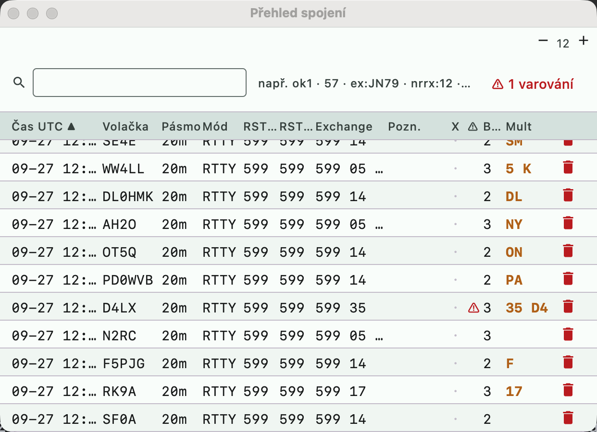

# Log window (QSO overview)

The window shows the QSOs of the active contest. In free logging (no contest
open) it shows the QSOs logged without a contest — see
[Getting started → Free logging](zaciname.md#free-logging-without-a-contest).

## Bulk edits

In selection mode (select rows by clicking, Shift+click for a range, Cmd+click for
individual rows) there is an edit menu in the bar above the table, as in N1MM+
([Log window → Right-click Menu](https://n1mmwp.hamdocs.com/manual-windows/log-window/#Right-click_Menu)):

| Button | Action |
|---|---|
| **Operátor…** (Operator...) | sets the operator on the selected QSOs (empty = delete) |
| **Mód…** (Mode...) | sets the mode (CW, SSB, RTTY, FT8...) |
| **Frekvence…** (Frequency...) | sets the frequency in kHz, and the band from it |
| **Posun času…** (Time shift...) | shifts times: `+5` / `-5` minutes, `+1:30`, `-2h`, `-90m` |
| **Interpolovat čas** (Interpolate time) | the first and last selected QSO keep their times, the others get evenly distributed times between them, rounded to minutes (a paper log entered after the fact). Requires at least 3 QSOs |
| **Smazat** (Delete) | deletes the selected QSOs (with confirmation) |

Each edit is saved, in a cluster it is sent to the other stations, and the score is
recalculated.

## Notes and X-QSO

- The **Pozn.** (Note) column is a note on the QSO: click it to edit it, in the entry window
  it is added with **Ctrl+N** ([keyboard-shortcuts.md](keyboard-shortcuts.md)). The table can be
  sorted by it.
- **X-QSO** (N1MM/DXLog "X-QSO flag"): the QSO stays in the log but is **not counted
  in the score**. In Cabrillo it is written as an `X-QSO:` line, which according to Cabrillo 3.0
  is a QSO that the adjudicator should not count (duplicate, invalid exchange...).
  - toggle: click in the **X** column, the row's context menu, or in bulk with the
    **X-QSO** button in the selection (when all selected ones are X, the mark is removed);
  - an X-QSO row is dimmed;
  - the flag is also carried over in a multi-op cluster.

## Warnings about possible errors

Like N1MM ([Warning of Possible Errors](https://n1mmwp.hamdocs.com/manual-windows/log-window/#Warning_of_Possible_Errors))
the table marks QSOs where there may be an error in the **⚠** column. The tooltip shows the reason:

- **the exchange differs** for the same station on different bands, e.g. zone 5 on 20 m
  and 4 on 40 m. All affected QSOs are marked. The report and serial numbers change
  naturally, so they are not checked;
- **the callsign is not in master.scp** (possible typo), only when SCP is loaded;
- **the zone does not match the country**: the received CQ or ITU zone is not among the zones of the
  DXCC entity of the callsign.

The **⚠ n varování** (n warnings) button in the search bar shows only QSOs with a warning, another
click shows all of them again. X-QSOs and deleted QSOs are not checked.

## Late entry of a paper log

A mode for transcribing a paper log after the contest, an equivalent of DXLog "Postcontest mode" and
N1MM "Entering Multiple QSOs After the Contest". Turn it on in the menu **Závod →
Dodatečné zadání** (Contest → Late entry) or with the command `POSTCONTEST`, turn it off the same way or with `NOPOSTCONTEST`.

- A **Čas UTC** (UTC time) field is added to the entry window. The QSO gets the entered time, not the current one.
- Just enter `1432` or `14:32`. The date is taken from the previous QSO, for the first one from the
  start of the contest. **Crossing midnight** is recognized automatically: after `2355`, `0005` means
  the next day. A shift back by a few minutes (an unsorted log) does not change the day. The date can also be
  entered in full: `2026-11-29 0110`.
- The time stays in the field for the next QSO as well, it is overwritten only when it changes.
- **Nothing is transmitted**: F-keys and ESM are off, Enter only logs.
- The entry window shows `DODATEČNÉ ZADÁNÍ` (LATE ENTRY).

When the paper log has no times, enter the time of the first QSO and then the real one for the last.
**Interpolovat čas** (Interpolate time) in the bulk edits spreads the rest evenly.

## Points and multipliers (Marking Multipliers)

An equivalent of N1MM **Marking Multipliers**
([doc](https://n1mmwp.hamdocs.com/manual-windows/log-window/#Marking_Multipliers)).
In a contest the table has two extra columns:

- **Body** (Points) — QSO points according to the contest rules; a dupe shows `0 D` in red.
- **Mult** — the new multipliers the QSO brought, with their values (zone `14`, country,
  prefix, district...). A multiplier is always on the **first** QSO that made it — after
  a QSO is deleted or corrected, the mark moves to the next one.

It is computed by replaying the log (like Rescore) in the background after every change.
X-QSOs and deleted QSOs have no marks. Outside a contest the columns are not shown.
