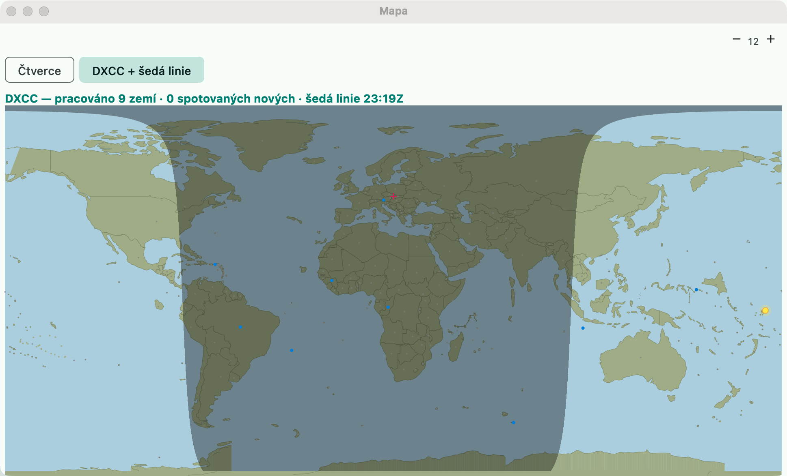

# Map

The map window has two modes (switch at the top):

## DXCC + gray line

An equivalent of N1MM **Grayline / Mapping** and the DXLog map. **Okno → Mapa DXCC a šedá linie**
(Window → DXCC map and gray line; without a contest the window opens directly in this mode).

- The night is darkened, the day/night boundary = the **gray line** (the terminator computed for the
  current time, recalculated every minute); the yellow dot = the Sun at its zenith.
- Each DXCC country is a dot at its center: **blue** = worked (from the log),
  **red** = spotted and not yet worked, gray = nothing so far.
- A cross = my station (locator / coordinates from Settings → Stanice (Station)).

## Squares

Multiplikátory → Čtverce (Multipliers → Squares) on the map: Maidenhead fields of a grid contest (worked,
spotted, double) — unchanged.

# Band notes

An equivalent of DXLog **Band notes**. **Okno → Poznámky k pásmům** (Window → Band notes):

- a note **for a frequency** (kHz, e.g. `14100` "NCDXF beacons") — in the bandmap a purple
  dotted line with the text, in the entry window `📝 text` when you are within 2 kHz,
- a note **for a band** (enter `20m` instead of a frequency) — for the whole band.

Notes are stored in the settings (`bandNotes` in `config.json`) and apply to all
contests.
