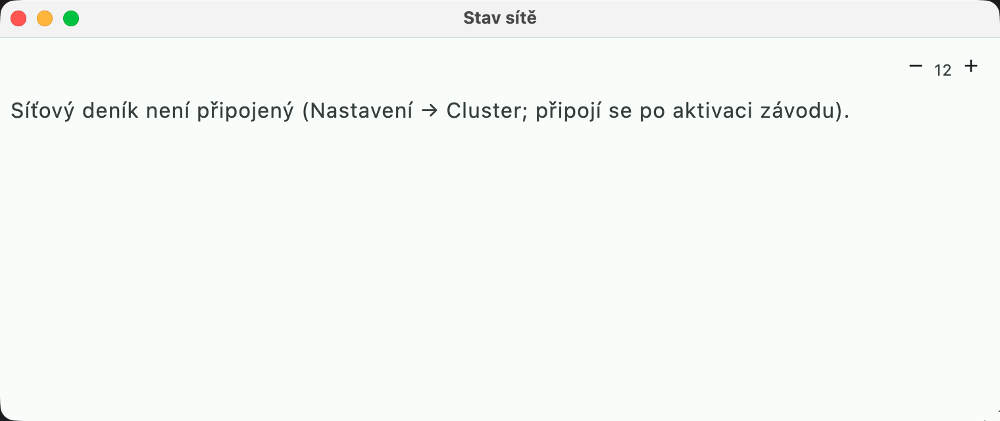
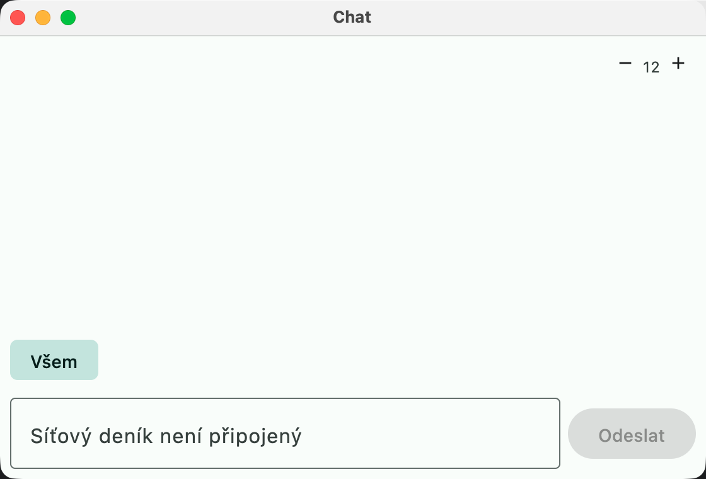
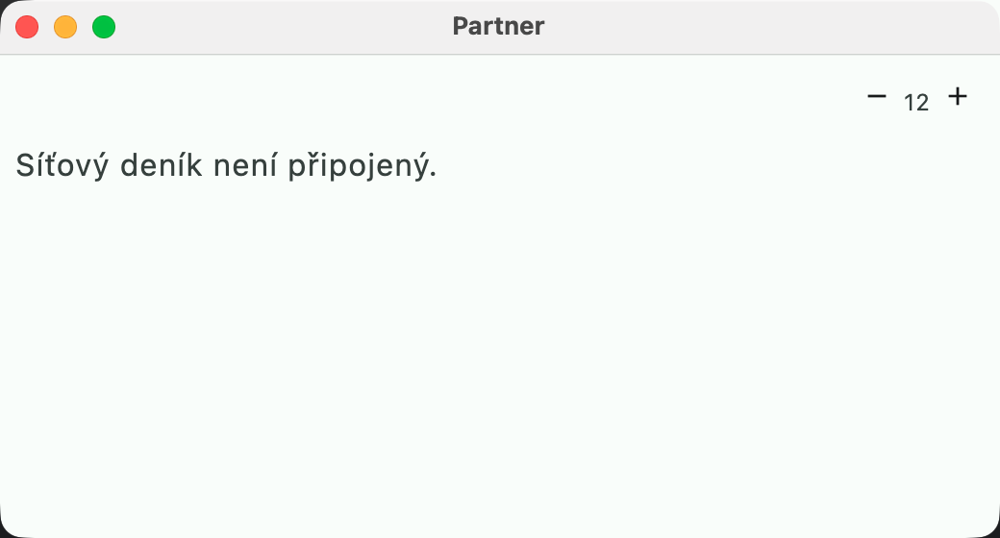

# Multi-op and the network

The network logbook (an MQTT broker plus the authority, a separate Java application
(cluster-app, Java 21) that is not part of this repository) shares operating information between the
stations in addition to QSOs.

## Network Status

**Okna → Stav sítě** (Windows → Network Status) shows all stations of the network logbook:
station ID, operator, band, mode, frequency, Run/S&P, QSO count and state:

- **online**: the station reports in (a heartbeat every 30 s, immediately on a change),
- **vysílá** (transmitting): the station is transmitting right now (shown in red),
- **neaktivní N s** (inactive N s): no heartbeat for more than 90 s,
- **offline**: the station disconnected or lost its connection (MQTT Last Will).

The state is retained on the broker (`station/status/<stationId>`), so a newly connected
station sees the others immediately. The broker ACL lets a station write only its own state
(see `docs/cluster-aclfile`).

## Chat

**Okna → Chat** (N1MM Messaging, DXLog Gab): messages to all stations or to one
(selected above the message line; it offers the stations from Network Status). Enter sends.
An incoming message also appears in the status line. Messages go through the broker on
`station/msg` (QoS 1, not retained, so offline stations do not receive them).

## Passing stations (pass)

A station you cannot work yourself (for example a multiplier on another band) is passed to a
station that is on the right band:

1. type the callsign into the callsign field,
2. press **Ctrl+Alt+P**. If exactly one other station is online, the callsign goes straight to
   it; otherwise **Stav sítě** opens and you click **Předat** (Pass) at the target station.

The recipient gets the callsign in its **bandmap** at its own frequency (spotter
`PASS-<station>`), in the chat and in the status line; the text also contains the frequency
of the passing station.

## Partner and call stacking

**Okna → Partner** (DXLog Partner, N1MM call stacking) is for the second operator who
listens to the pileup on the same rig or on a second receiver:

- selects a runner (an online station) and sees its band, mode, frequency and **what the
  runner is currently typing into the callsign field**,
- types a callsign and sends it with Enter to the **runner's stack**.

The runner sees the stack in the entry window ("ZÁSOBNÍK DL1ABC K1ZZ", that is, "STACK ...")
and **Ctrl+Alt+K** puts the next callsign into the field. The stack holds at most 10
callsigns without duplicates.

## Interlock / TX lockout

**Nastavení → Cluster → TX interlock** (Settings → Cluster → TX interlock):

- **Kdekoli (jeden signál)** (Anywhere, one signal): for categories with one signal at a time
  (M/S, M/2): when any other station transmits, this one does not transmit,
- **Na stejném pásmu** (On the same band): inband operation (DXLog "Interlock and inband
  operation"): only stations on the same band are blocked.

CW (function keys, ESM, CW from the keyboard), the voice keyer, digital transmission and
tuning with a carrier are blocked; the status line shows "TX LOCKOUT: vysílá STN2"
(transmitting). The start of a transmission is announced to the others immediately, the end
within 1 s. The interlock goes over the network (the broker), so it has a latency of tens of
ms. It does not replace a hardware lock (for example a switch with a PTT interlock) when two
stations press the key at the same moment.

## Serial number server

When several stations send serial numbers from a **common series** (M/S, M/2), two stations
could send the same number at the same time. **Nastavení → Cluster → Pořadová čísla ze serial
number serveru** (Settings → Cluster → Serial numbers from the serial number server) solves
this the way N1MM/DXLog do:

- the authority issues numbers from one series: 1 + max(the highest sent number in the log,
  the last issued one),
- the station has the number for the next QSO **reserved in advance** (request
  `serial/request`, reply `serial/reply/<stationId>`); after a QSO is written it asks for the
  next one immediately,
- until the reservation arrives (the authority is not running, a network outage), the station
  counts locally (local-first) and the entry window shows "SNS: čekám na číslo" (waiting for
  a number).

An issued but unused number (a reservation at the end of the contest) stays as a gap in the
series, as in N1MM. After the authority restarts, the series continues from the highest
logged number.

## Station type (RUN / MULT) and band change rules

**Nastavení → Cluster** (Settings → Cluster):

- **Typ stanice** (Station type; DXLog Station type): *RUN* or *MULT*. A MULT station may only
  log a QSO that brings a new multiplier. The others see the type in Network Status.
- **Pravidla provozu při zápisu** (Operating rules on write): *Nehlídat* (Do not check) /
  *Upozornit* (Warn, the default) / *Nezapsat* (Do not log). The tool checks the N-minutes-on-a-band
  rule (for example CQ WW M/S 10 min) and the limit of band changes per hour (for example
  CQ WPX M/S 10/h) according to the rules of the **selected category** in the contest
  definition. With *Nezapsat*, a write goes through only with **Ctrl+Alt+Enter**.

Only the QSOs of **this station** are counted (in the network logbook not the QSOs of the
others), so the run and mult stations each have the rule separately. The timer of time on a
band and the counter of changes stay in the Rate window.
