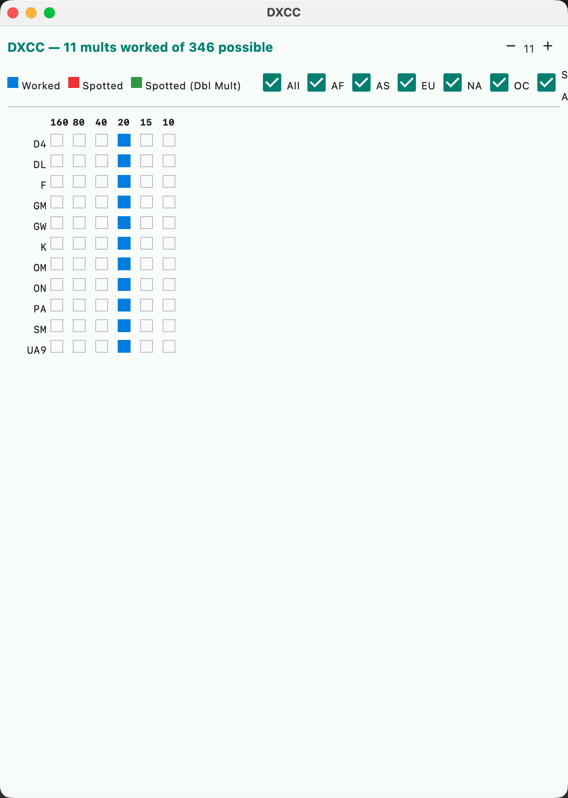
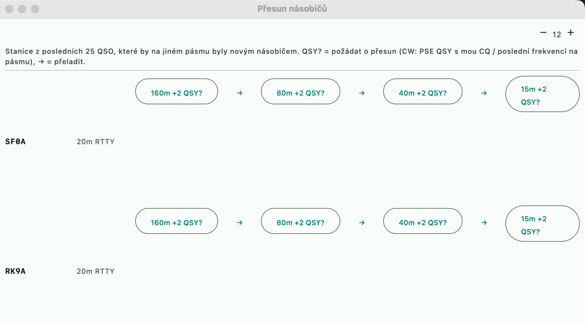

# Multiplier windows

An equivalent of the N1MM+ **Multipliers window**
([Key Common Features](https://n1mmwp.hamdocs.com/manual-windows/multipliers-window/#Key_Common_Features))
and DXLog **Worked DXCC**. Open via the menu **Multiplikátory** (Multipliers).

| Window | What it shows |
|---|---|
| **DXCC** | countries (a DXCC-type set), continent filter |
| **Velké čtverce** (Large squares) | Maidenhead fields (`grid_fields`) |
| **ITU / CQ** | zones |
| **Okresy** (Districts) | multipliers from a received field of type `DISTRICT` (e.g. OK-OM DX) |
| **Section/States** | multipliers from a `STATE` / `PROVINCE` field (W states, VE provinces, ARRL sections) |
| **Ostatní** (Other) | the contest's first additional multiplier: IARU HQ, WPX prefixes... |

Each row = a multiplier value, columns = bands 160–10 m: **worked**,
**spotted** (a new multiplier in the cluster, double multiplier separately), empty. Clicking a
spotted cell tunes to the spot. For enumerated sets (countries, zones, districts, states) the
unworked values are shown too, along with a "worked of possible" count; for open sets
(prefixes, squares) only the worked ones.

Which category a multiplier belongs to is decided by the set type and the exchange field type in the
contest definition — a new contest with districts or states appears in the windows by itself. Spotted cells
are supported only for DXCC, zones and squares (a district or state cannot be inferred from a spot).

## Move Multipliers

An equivalent of N1MM **Move Multipliers**
([doc](https://n1mmwp.hamdocs.com/manual-windows/the-move-multipliers-window/)) and
DXLog **QSY wizard**. Open via **Okno → Přesun násobičů** (Window → Move multipliers).

- It goes through the last 25 QSOs and for each station shows the contest bands where it would be
  a **new multiplier** and would not be a dupe (`40m +2` = two new multipliers).
- **QSY?** asks for a move: in CW it sends `PSE QSY 7025` — the frequency is my CQ
  frequency on the target band, otherwise the last frequency I was on there
  (without it just `PSE QSY 40M`). In phone it hints in the status line what to say.
- **→** tunes the rig to that frequency.
- It is evaluated as a preview according to the contest rules (dupe, multiplier scope), nothing is
  logged.
