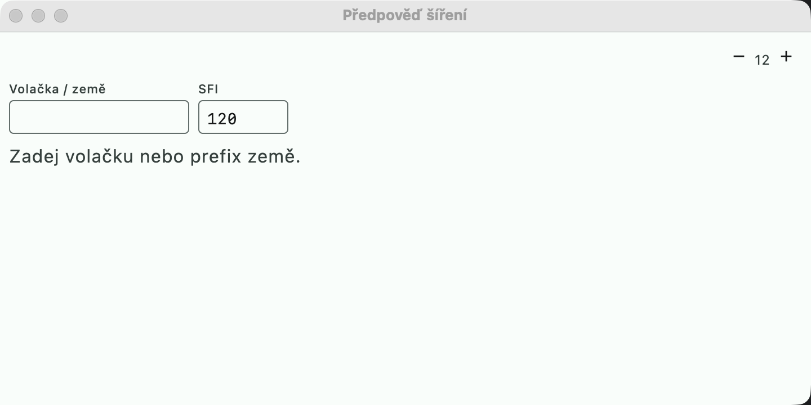

# Propagation forecast

An equivalent of the **HamCAP / VOACAP** chart from the N1MM Info window — a **simplified custom
model**, not VOACAP. Open via **Okno → Předpověď šíření** (Window → Propagation forecast).

- Path: from the station's locator (Settings → Stanice (Station)) to the country of the callsign from the field (or
  an entered callsign / prefix).
- **SFI** is pre-filled from the latest WWV message of the DX cluster (it can be overwritten).
- A table of 24 UTC hours × bands 160–10 m: **green** = open, **yellow** =
  marginal (close to the MUF), gray = closed. The current hour is highlighted.

## Model

1. SSN from SFI (`(SFI − 63.7) / 0.728`).
2. Critical frequency foF2 at the path's control points (1000 km from both ends) according to the
   height of the Sun: night minimum 2.3 + 0.012·SSN, noon maximum 5 + 0.055·SSN MHz.
3. MUF = the lower foF2 × hop factor (up to 3 for a hop of 3000 km and more).
4. LUF: D-layer absorption in daytime according to the height of the Sun at the path ends.
5. Open = between the LUF and 85% of the MUF, marginal = up to the MUF.

The result is indicative — it does not account for sporadic E, geomagnetic storms
(K-index) or long-path propagation.
