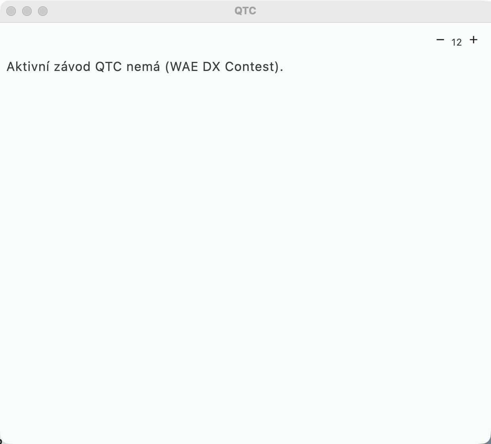

# QTC (WAE DX Contest)



Equivalent of the N1MM **QTC window** for the [WAE DX Contest](https://www.darc.de/der-club/referate/conteste/wae-dx-contest/en/).
The contests `wae-cw` and `wae-ssb` are in the contest data.

## Rules in the definition

```yaml
scoring:
  qtc: { points: 1, maxPerStation: 10, groupSize: 10 }
  total: "(qsoPoints + qtcPoints) * multTotal"
multipliers:
  - { id: countries, set: dxcc_entities, from: callsign, scope: PER_BAND,
      bandWeights: { 80m: 4, 40m: 3, 20m: 2, 15m: 2, 10m: 2 } }
```

- Each QTC = 1 point, at most 10 QTCs with one station.
- Multipliers per band with a **band weight** (`bandWeights`, 80 m ×4, 40 m ×3,
  higher ×2) — a general DSL feature, usable elsewhere as well.

## The QTC window

**"Okno → QTC (WAE)"** (Window → QTC (WAE)):

- **Receive QTC** ("Přijmout QTC", a European station): station, series (`3/10`)
  and lines `time callsign number` (`1234 DL1ABC 56`). Unreadable lines are shown
  in red.
- **Send QTC** ("Poslat QTC", a non-European station): a series from your own log
  — chronologically, only QSOs not yet reported and not QSOs with the same
  station, at most the free count. **"Odvysílat CW"** (Send CW) sends
  `QTC 3/10 1234 DL1ABC 56 ...` with the keyer, **"Potvrzeno — uložit"**
  (Confirmed — save) records the series.
- The limit of 10 QTCs per station is enforced, and the list of exchanged QTCs can
  be deleted.
- QTC points are in the score immediately (also after recalculation), and in
  Cabrillo as `QTC:` lines after the QSOs:
  `QTC: freq mo date time sender series/count recipient time callsign number`.

QTCs are stored in the log (table `qtc`); cluster sync does not transfer them
between stations.
