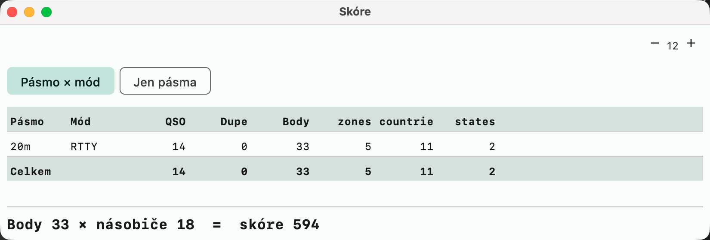

# Score window

An equivalent of N1MM+ **Score Summary**
([Score Window](https://n1mmwp.hamdocs.com/manual-windows/score-window/)) and DXLog
**Summary**. Open it with **Okno → Skóre** (Window → Score), or by clicking the score bar below the entry window.

- A **band × mode** table (the "Jen pásma" (Bands only) switch merges modes): QSOs, dupes, points and
  **new multipliers by type** (zones, countries, prefixes... according to the contest
  definition).
- A multiplier is credited to the band and mode where it was made **first** — so for multipliers
  counted once per contest (scope `ONCE`) only to one band.
- A **Celkem** (Total) row, and for multi-mode contests also totals **by mode**.
- At the bottom the result: `Points × multipliers (+ bonus) = score`.
- It is computed by replaying the whole log (like Rescore), so it is correct after editing QSOs
  or importing; X-QSOs and deleted QSOs are not counted. It refreshes itself after every
  change to the log.

## Rescoring the last N hours

**"Nástroje → Přepočítat posledních N hodin…"** (Tools → Rescore last N hours...), equivalent of N1MM **Rescore
last N Hours**, asks for a number of hours (1 to 8760, default 24) and rescores only the QSOs of that window,
counted back from now (the clock of the computer, UTC). It is the manual **Přepočítat skóre** (Rescore) limited to
the window: the QSOs before it are still replayed, because they decide what is a dupe and which QSO first brings a
multiplier, so the result of every QSO in the window is exactly what a full rescore gives; they are only not
written to. The window's QSOs are the ones counted in the report (and the ones whose missing country is filled in);
the score shown is the whole log's. With no QSO in the window nothing is done and the status line says so.

In free logging (without a contest) the window only states that the breakdown is not available.
