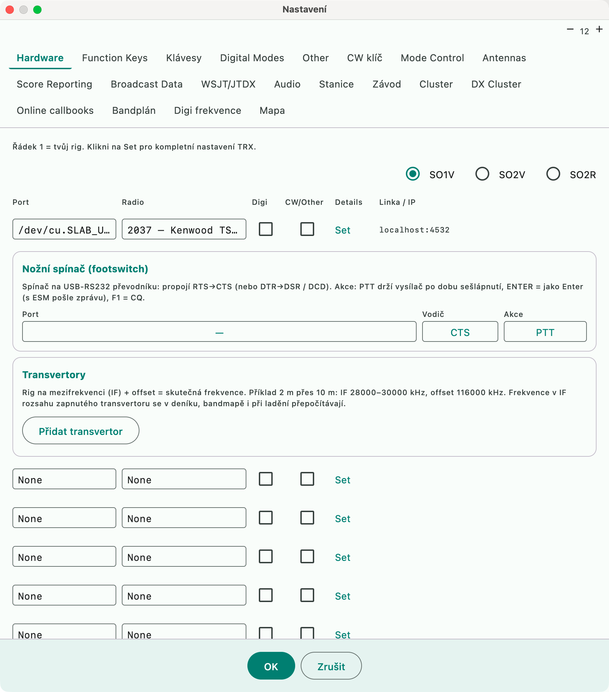
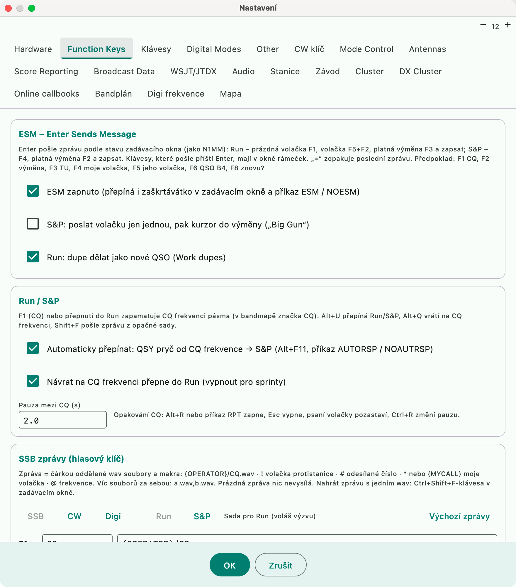

# Settings (Configurer)



There are 19 tabs; almost all of the logger's behavior is hidden beneath them. Two
of them are visited most often:




All Settings tabs are functional (the earlier mock-ups of the N1MM layout have been replaced):

| Tab | Contents |
|---|---|
| Hardware | rig (hamlib), SO1V / SO2V / SO2R, rig 2 and OTRSP, foot switch, transverters |
| Function Keys | CW and voice messages F1–F12, ESM |
| Klávesy (Keys) | remapping of shortcuts |
| Digital Modes | how to log the rig's data mode (PKTUSB → FT8 / RTTY / DIGITAL...) |
| Other | CW speed step, tuning and RIT step (CW / phone), RIT clearing after a QSO, dupe beep |
| CW klíč (CW keyer) | Winkeyer / CAT keying |
| Mode Control | mode in the log taken from the rig / band plan / always fixed; RTTY sent to the rig as FSK or AFSK |
| Antennas | antenna table, rotator (rotctld, UDP) |
| Score Reporting | online scoreboard, Club Log Live Stream, DXCC from Club Log ([DXCC data](dxcc-data.md)) |
| Broadcast Data, WSJT/JTDX, Audio, Stanice (Station), Závod (Contest), Cluster, DX Cluster, Online callbooks, Bandplán (Band plan), Digi frekvence (Digi frequencies), Mapa (Map) | unchanged |

## OK, Apply and Cancel

The buttons at the bottom are **OK**, **Použít** (Apply) and **Zrušit** (Cancel).
OK saves everything and closes the window. **Apply** (also ⌘S) does exactly the
same save and applies the same changes (reconnects, language, keys, ...) but keeps
the window open on the same tab, so you can carry on editing; it is greyed out
while nothing has changed. Cancel afterwards closes the window without undoing what
was applied. If saving fails, the window stays open with your edits and an error is
shown, for both OK and Apply.

## Interface language

The texts in the application are in Czech and are translated using files in the
**`language`** directory in the application data (macOS
`~/Library/Application Support/MacContestLogger/`). The list of languages is **not
written into the application** — it is the contents of that directory, so anyone can
add a translation by copying a file there.

**Convention: `lang_<code>.json`** (`lang_de.json`, `lang_pl.json`, `lang_pt_BR.json`).

```json
{
  "_name": "Deutsch",
  "Skóre": "Punkte",
  "Mapa": "Karte"
}
```

- the **key** is the Czech text exactly as it appears in the application; the **value** is the translation;
- **`_name`** (optional) is the language name for the menu — without it the code is shown in capital letters;
- **anything missing stays in Czech**, so you can translate in parts and an incomplete file breaks nothing;
- a **faulty file** does not crash the application: the language stays in the menu, it is just not translated.

**Nastavení → Other → Jazyk / Language** (Settings → Other → Language) offers the
list of languages found, **Načíst znovu** (Reload, after copying a file) and
**Otevřít adresář** (Open directory). The language switches immediately after OK,
without a restart.

The application ships with **English** (`lang_en.json`) and **German**
(`lang_de.json`); both files are extracted into the directory on first launch and
also serve as templates. An existing file is never overwritten, so your own edits
are preserved.

To start a new translation, use `lang_en.json` from the `language` directory as the
template — it contains all the keys. Copy it to `lang_<code>.json` and replace the
values with your translation; what is still untranslated stays visible as the
original. Do not write the keys by hand — a hand-written list drifts apart from the
code as soon as a text is renamed.

Some messages contain **`%s`** as a placeholder for a value filled in at runtime
(`"Opraveno %s z %s QSO"`). The translation must keep the same number of
placeholders; their order may be rearranged.

## Mode Control

- **Podle módu rigu** (By the rig's mode) — the default.
- **Podle bandplánu** (By the band plan) — CW in the CW segment, SSB in phone, in the digital
  segment the specific digital mode from the rig (FT8...), otherwise DIGITAL. Useful
  when the rig reports USB even for digital operation.
- **Vždy** (Always) — a fixed mode (e.g. RTTY when operating through an external program).
- **RTTY to the rig**: FSK (the rig's RTTY mode) or AFSK (data mode PKTLSB).

A single-mode contest has its mode set by the definition; the rules apply to free
logging and multi-mode contests.

## Windows and their restoration

Each tool window remembers its **position and size** (`windowGeometry` in
`config.json`), and open windows are reopened after a restart (`openWindows`): log,
CAT log, available multipliers, DX cluster, bandmap, blacklist, HamQTH log, Info,
skeds, score, multiplier transfer, dupesheet, rotator, statistics, propagation
forecast, band notes, waterfall, definition editor, QTC, map (also in DXCC mode)
and the multiplier windows (DXCC, zones, districts...). The second SO2V/SO2R entry
window opens automatically according to the mode in Settings → Hardware. Dialogs
(New contest, operator...) are not restored.

## Appearance

**Nastavení → Other → Vzhled** (Settings → Other → Appearance):

- mode **follow the system** (default), **light** or **dark** — applies to all windows,
- **color accent**: teal (default), blue, orange, or **high contrast**
  (black background, white text, yellow accent — for night operation),
- each window has its own font size (A− / A+ at the top right), and the window remembers it.

## Settings profiles

An equivalent of N1MM's multiple configurations / DXLog profiles. **Nastavení →
Profily nastavení…** (Settings → Settings profiles...):

- **Uložit aktuální** (Save current) — the entire configuration (station, rig, keys, F-key messages, cluster,
  appearance...) under a name, e.g. "Home", "Expedition", "Multi-op" (`profiles/<name>.json`
  in the data directory),
- **Načíst** (Load) — overwrites the current settings with the profile and immediately applies keys, modes,
  rig mode and contest definitions; connections to the rig and networks need to be re-established (or
  restart the application),
- **Smazat** (Delete) a profile.

Logs and databases are not changed by a profile.

## Language

**Nastavení → Other → Jazyk / Language**: Czech (default) or English, plus any other
language file found in the `language` directory (see above). In English, the menus,
window titles, Settings tabs, log table headers and the main labels of the entry
window and score bar are translated; status line messages and the documentation
remain in Czech. The key is the Czech text and a missing translation is displayed in
Czech; a test checks that the entire menu is translated.

## Time synchronization

An equivalent of DXLog **Sync time** / N1MM time synchronization. **Nastavení → Other →
Synchronizace času** (Settings → Other → Time synchronization):

- **NTP server** (default `pool.ntp.org`, empty = off) — at startup, after saving the
  settings and every half hour, the deviation of the computer's clock is measured (SNTP),
- a deviation above 1 s: a warning in the status line and messages, and `HODINY +2.3 s`
  ("CLOCK +2.3 s") in the entry window,
- **Opravovat čas nově zapsaných QSO** (Correct the time of newly logged QSOs) — the QSO time is shifted by the
  measured deviation (the system clock is not changed; that requires administrator
  rights — it is recommended to turn on automatic time in System Settings). A manually
  entered time (late entry) is not changed.

## Menu bar

The menus follow N1MM+: **Soubor** (File), **Úpravy** (Edit), **Závod** (Contest), **Nástroje** (Tools),
**Nastavení** (Settings), **Okno** (Window) and **Nápověda** (Help). The application menu keeps About,
Settings `Cmd+,` and Quit.

| Menu | Items |
|---|---|
| Soubor (File) | New contest, Open contest, New / Open database, Import (QSOs, Merge log), Export (ADIF, Cabrillo, EDI, CSV / text / summary), Print log |
| Úpravy (Edit) | the entry window's actions with your current keys shown next to them (wipe, restore, +1 to the number, note, find, delete last QSO), then Undo, Redo, Cut, Copy, Paste and Select All for the text fields |
| Závod (Contest) | Late entry, Record contest, None (free logging) |
| Nástroje (Tools) | Rescore, Recalculate DXCC in the log, Download master.scp, Update definitions, Update DXCC from Club Log, Update call history, Load beacon file, Definition editor |
| Nastavení (Settings) | Settings (all tabs), Keys, Settings profiles |
| Nápověda (Help) | Documentation (`Alt+H`), Keyboard shortcuts, Text commands, Report a bug (GitHub issues), Open data folder (honours `MCL_DATA_DIR`) |

The keys in the Edit and Help menus are only shown: the entry window's own key handling (Settings → Keys)
stays the one that reacts to them, so a remapped key is shown as remapped.

A `menu.json` of your own (below) replaces the built-in menu as a whole. If you made one before this
layout, it keeps your old structure; to get the new one, create a fresh copy with **Vytvořit menu.json k
úpravám** after moving the old file away. A node whose `id` starts with `sep.` is a separator line.

## Application menu

The menus in the top bar (and the list of Settings tabs) are described by `menu.json`.
The application looks for it **in the data directory**:

```
~/Library/Application Support/MacContestLogger/menu.json
```

Until the file exists there, the built-in definition from the application is used —
it cannot be edited because it is packaged inside the bundle. You create your own
copy in **Nastavení → Other → Menu aplikace** (Settings → Other → Application menu)
with the **Vytvořit menu.json k úpravám** (Create menu.json for editing) button; the
button does not overwrite an existing file. **Otevřít adresář** (Open directory) shows
it in Finder, **Načíst menu znovu** (Reload menu) applies your edits to the running
application (no restart needed).

Each node has an `id` (it does not change — it identifies the action), an optional
`label` (any caption you want) and a `state`:

| `state` | What it does |
|---|---|
| `enable` | the item is visible and works (default) |
| `disable` | the item is visible but grayed out |
| `hidden` | the item is not shown at all |

An unknown value is treated as `enable`, so a typo (`hide` instead of `hidden`)
shows up as the item remaining visible.

A faulty file does not deprive the application of its menus: at startup a dialog
with the reason is shown (including the line and column in the JSON) and the
built-in menu runs. Deleting the file returns you to the built-in definition.
