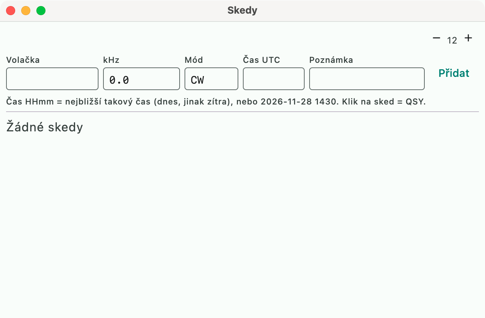

# Skeds

Scheduled contacts, like the N1MM+ [Sked system](https://n1mmwp.hamdocs.com/manual-windows/sked-system/).
The window opens from the menu **Okna → Skedy** (Windows → Skeds).

- Form: **callsign, frequency (kHz), mode, UTC time, note**. Frequency and mode
  are pre-filled from the rig.
- **Time:** `1430` or `14:30` means the nearest such time (today, or tomorrow if it has
  already passed). You can enter it exactly as `2026-11-28 1430`.
- Skeds are **stored with the contest**, so they survive a restart.
- **Clicking a sked** tunes the rig to its frequency and mode and puts the callsign in the field.
- The **reminder** works even with the window closed. A minute before the time the sked is announced
  in the status line and in the Info window, and in the Skeds window it lights up for up to 5 minutes after the time. Ten
  minutes ahead the entry window shows `SKED 1430 DL1ABC`. Past skeds are gray.

Unlike N1MM, skeds are not yet copied to the other stations of a multi-op cluster.
