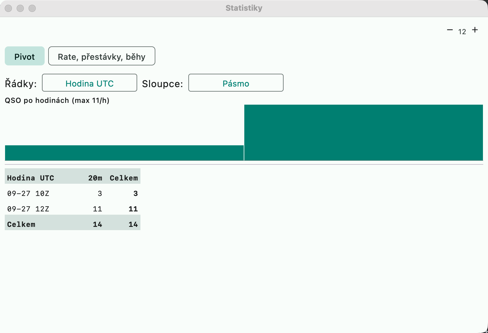

# Statistics

## Pivot statistics

An equivalent of N1MM+ **Statistics** and DXLog **Summary / Statistics**. Open via
**Okno → Statistiky** (Window → Statistics).

- At the top a **QSOs per hour** chart (with the maximum).
- A table: **Řádky** (Rows) × **Sloupce** (Columns) from the dimensions UTC hour, day, band, mode, continent,
  country, operator, Run / S&P (columns also "—" = total only). Hours and days are in
  chronological order, bands by frequency, the rest by QSO count.
- Row totals, column totals and the overall count; deleted QSOs are not counted.

Typical views: hour × band (when and where), continent × band (propagation), operator ×
mode (multi-op).

## Rate, breaks, runs

An equivalent of N1MM **Rate** reports and DXLog statistics. In the Statistics window, switch to
**Rate, přestávky, běhy** (Rate, breaks, runs):

- **Best rate** over 10 and 60 minutes (QSO count, per-hour equivalent, window start).
- **Breaks** of at least 30 minutes between QSOs and their total (a check of off-time rules).
- **Run streaks** — consecutive Run QSOs on one band and frequency (±2 kHz, gap
  up to 10 min, at least 5 QSOs): start, band, frequency, count, length, rate.
