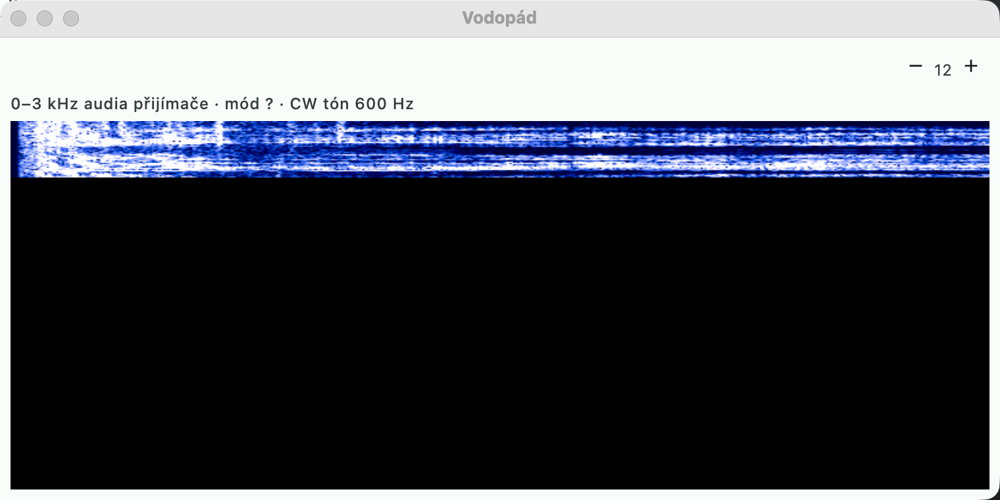

# Waterfall and receiver audio

## Waterfall

An equivalent of the spectrum / panadapter in N1MM+ (Spectrum Display) and DXLog — without an
SDR, from the **receiver audio**. Open via **Okno → Vodopád** (Window → Waterfall).

- **Nastavení → Audio → Příjem** (Settings → Audio → Receive): the sound card input that carries the audio
  from the rig (USB audio CODEC), and the receiver's **CW tone** (default 600 Hz).
- The window draws an FFT of the audio, 0–3 kHz, newest line at the top; noise in dark blue, strong
  signals up to yellow. The brightness adapts to the noise floor.
- Hovering the mouse shows the frequency on the band according to the rig's mode (CW, CW-R, USB, LSB, data).
- A **click** tunes the rig: in CW so that the station sounds at the CW tone (yellow line);
  in SSB you click on the lower edge of the signal (USB) — that is where its carrier is.

The input is opened only while the window is open (and for other users of the audio — CW decoder,
contest recording) and is released after it is closed.

## Contest recording

An equivalent of N1MM **QSO recording** / DXLog **Audio recorder**. **Závod → Nahrávat závod
(zap / vyp)** (Contest → Record contest (on / off)):

- the receiver audio (Settings → Audio → Receiver input) is written to WAV files by
  UTC hour: `…/MacContestLogger/recordings/20261128-12.wav` (12 kHz, 16 bit, mono —
  about 86 MB per hour),
- `● REC` lights up in the entry window, and the setting is remembered after a restart,
- **Přehrát nahrávku QSO** (Play QSO recording) in the context menu of a log row plays 10 s before and 5 s after
  the QSO time (a dispute over a callsign or number),
- after a restart within the same hour, recording continues into the same file.
