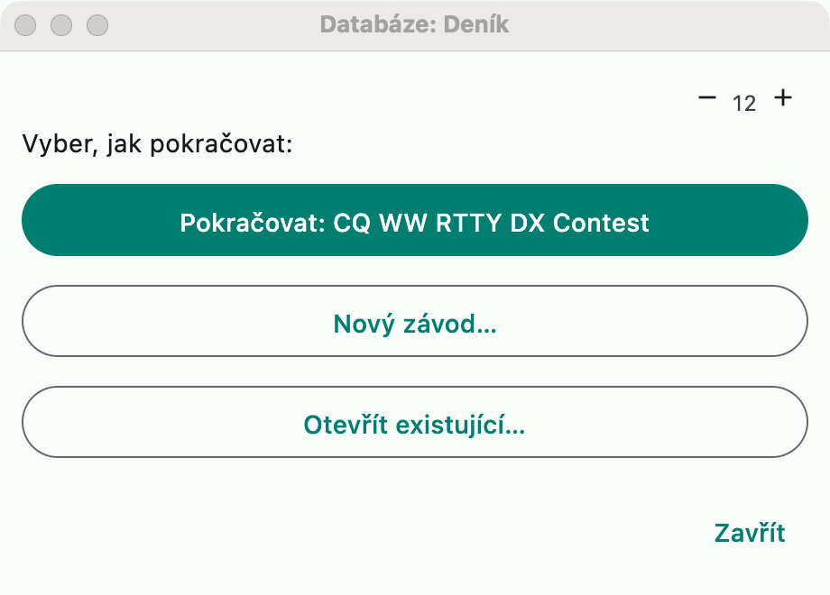
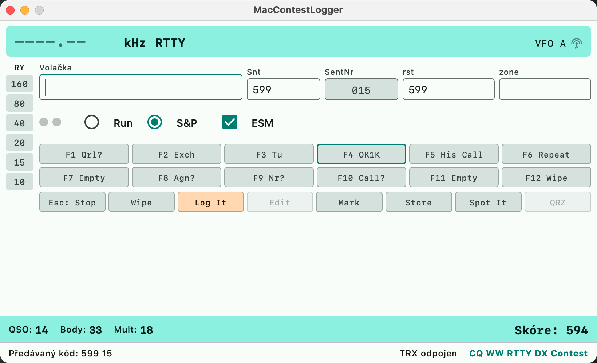

# Getting started

A guide from the first launch to a submitted log. Details for each step are on
separate pages, linked where relevant.

## What you need

| | |
|---|---|
| **macOS** | Apple Silicon and Intel; the `.dmg` installer is built by CI, or run from source: `scripts/bundle.sh --config release`, then open `build/app/MacContestLogger.app` |
| **Contest definitions** | a directory with `contests/*.yaml` and `multipliers/*.yaml` — the repository ships `contest-data/` as a starting point. They are **not part of the application**; you enter the path in Settings |
| **DXCC data** | `~/dxcc-json/` with `cty.dat` (more accurate) or `dxcc.json`. Without it, country and multiplier detection will not work. Get it with `git clone https://github.com/k0swe/dxcc-json ~/dxcc-json` |
| **Radio** (optional) | via hamlib `rigctld` — see [Settings](settings.md) |

## First launch

After startup the application asks how to continue:

- **Pokračovat** (Continue) — opens the last contest where you left off.
- **Nový závod…** (New contest...) — you pick a definition and enter your callsign and station details.
- **Otevřít existující…** (Open existing...) — switches to another contest in the same database.

A database is a single SQLite file per contest; with **Databáze → Nová databáze…**
(Database → New database...) you can create several (for example one per weekend).

Before you start logging, go through **Nastavení** (Settings, `Cmd+,`): callsign and
station details, the directory with contest definitions, CAT, keyer and F-key
messages. Everything is described in [Settings (Configurer)](settings.md).

## Entry window

This is where you type the callsign and the received exchange. What you see:

- **At the top**, the frequency and mode from the radio; on the left, the band bar —
  for a callsign being typed it is colored according to where the station has
  already been worked ([Call check](call-check.md)).
- **Run / S&P** switches the set of F-key messages ([Run / S&P](run-sp.md)).
- **ESM** = Enter Sends Message: Enter sends whatever makes sense at that moment —
  the CQ call, the exchange, the confirmation — and logs the QSO ([ESM](esm.md)).
- **F1–F12** are keyer messages, separate for CW, SSB and digital
  ([CW keyer](cw-keyer.md), [Voice keyer](voice-keyer.md), [Digital modes](digital-modes.md)).
- **At the bottom**, the running score and the CAT status.

The keys that control everything else are listed in
[Keyboard shortcuts](keyboard-shortcuts.md); you can also type
[text commands](text-commands.md) (QSY, mode change, `OPON`, `WIPELOG`...) into the
callsign field.

## Logging a contact

1. Type the callsign. Dupes, possible typos and the multiplier the QSO would bring
   are reported as you type.
2. Press Tab to move to the exchange and fill it in. In many contests the zone or
   district is pre-filled with a guess based on the callsign — you can always
   overwrite it.
3. **Enter** (with ESM) or the **Log It** button logs the QSO.

Logged contacts appear in the [log window](log-window.md), the score in the
[Score window](score-window.md), and the multiplier breakdown in the
[multiplier windows](multipliers-window.md).

## Free logging (without a contest)

You do not need a contest to log. With **Závod → Žádný (volné logování)**
(Contest → None (free logging)), the `CLOSE` command, or simply before you open a
contest, the entry window has generic fields (received report and exchange) and
**Enter** / **Log It** saves the QSO into the open database without a contest — no
points or multipliers, the country is filled in as usual.

- The [log window](log-window.md) then shows only the free-logging QSOs; opening a
  contest again shows only that contest's QSOs. The two logs never mix.
- The same callsign on the same band is flagged as a dupe, but it is only a
  warning — the QSO is still logged.
- **Export ADIF** writes the free-logging QSOs (without `CONTEST_ID`); Cabrillo
  needs a contest.
- Free-logging QSOs stay on this station: they are not sent to the
  [network logbook](multi-op.md).

## After the contest

**Databáze → Export** (Database → Export): Cabrillo for the organizers, ADIF for
your own log or LoTW, CSV and a summary for yourself. Details in
[Import and export](import-export.md).

Before exporting, go through the **⚠** column in the log — it flags contacts where
something does not add up (suspicious exchange, improbable zone).

## Where next

- [Keyboard shortcuts](keyboard-shortcuts.md) — worth going through before a contest
- [DX cluster](dx-cluster.md) and the bandmap — spots, colors by status, band plan
- [Multi-op and network](multi-op.md) — several stations on one log
- [Contest definition editor](definition-editor.md) — when your contest is missing
